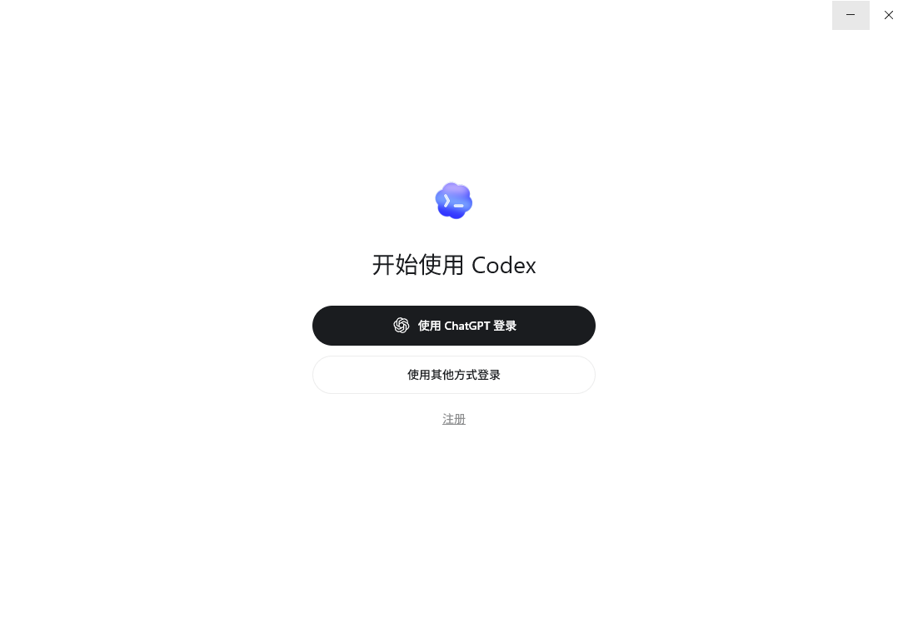
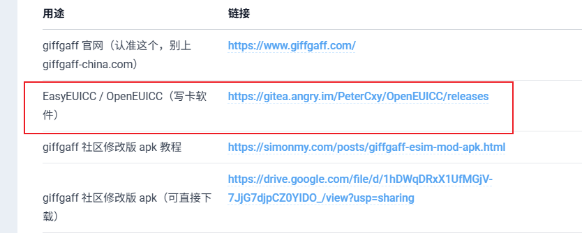
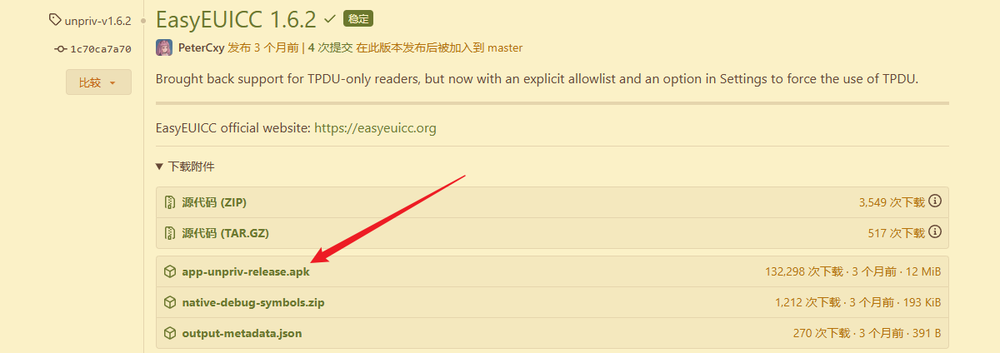
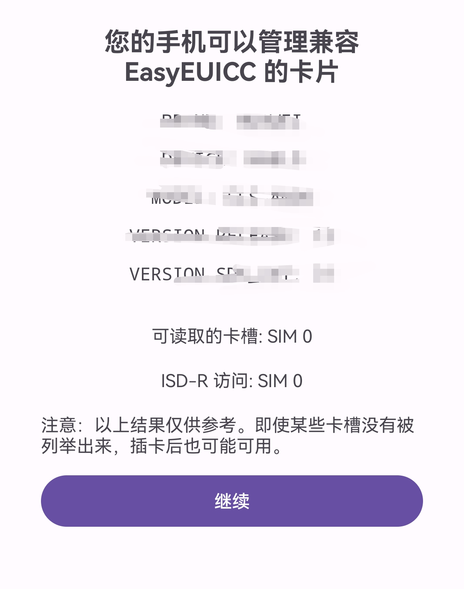
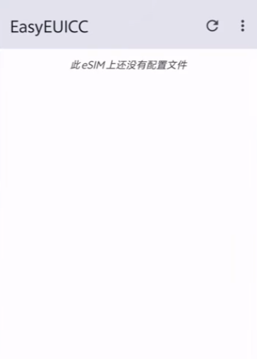
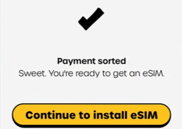

# CodeX简介

官网：https://openai.com/zh-Hans-CN/codex/

## 1，使用方式

Codex CLI、VS Code插件版、桌面客户端、网页版。

需要注册一个ChatGpt账号，最好开通Plus会员。

# 国内自制海外eSIM卡

## 1，检测设备是否支持

https://feifei.537393.xyz/posts/giffgaff-esim/

下载EasyEUICC检测你的国行手机是否兼容制作esim：https://gitea.angry.im/PeterCxy/OpenEUICC/releases

点击安装

在手机端点击检测兼容性按钮，出现以下内容表示兼容：

## 2，购买“小白卡”

主流电商网站搜索小白卡（esim转实体sim插拔卡），注意：**需要支持EUICC**

## 3，支付卡

**单标**：visa卡或万事达信用卡

## 4，开始制作

1）将“小白卡”插入手机中，进入EasyEUICC软件中，出现一下界面表示小白卡识别成功

2）安装社区修改版 giffgaff App

下载地址：https://drive.google.com/file/d/1hDWqDRxX1UfMGjV-7JjG7djpCZ0YIDO_/view?usp=sharing

安装完成后使用 email 注册 giffgaff账号。

3）购买esim

首页点击 eSIM标签，点击下方的Choose your plan，将新 套餐界面拉到最下面，点击 i don't  want a plan，

然后充值，要求最少 10英镑大概90+RMB，支付方式点击Card，点击添加银行卡。账单信息名字地址随意填写，

出现如下页面表示付款成功：

然后点击 继续安装 eSIM，接下来会弹窗展示你的eSIM激活码，分享到个人微信账号再进行完整复制，

电脑上访问 QRcode.show，输入LPA:你的激活码，点击Generate

4）回到EasyEUICC

点击 + ，确认你的小白卡卡槽，选择用相机扫码。

点击三个点，手动启用，接下来手机会收到giffgaff发来的欢迎短信