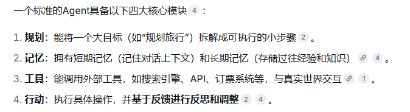

# 大语言模型（LLM）

1，能力：理解和生成语言、进行内容创作、知识问答等。

2，工作方式：被动响应。你问，它才答，不会主动发起行动。

3，能力边界：知识有“截止日期”，无法获取实时信息或直接操作外部软件。

# 智能体（Agent）

Agent（AI Agent，人工智能智能体） 是一个具体的、能自主行动的软件系统。它以大模型为“大脑”，但远不止于此，它是一个能完成完整任务的“行动派”。

