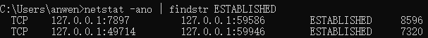
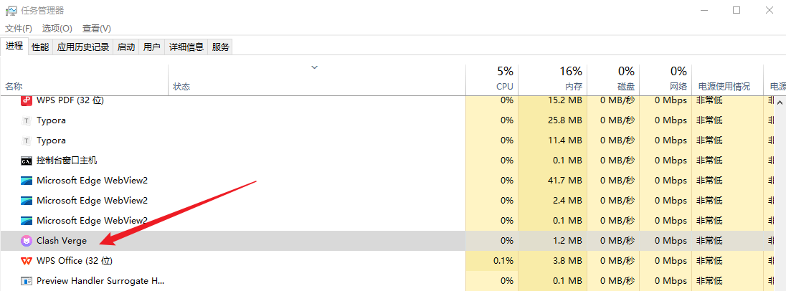
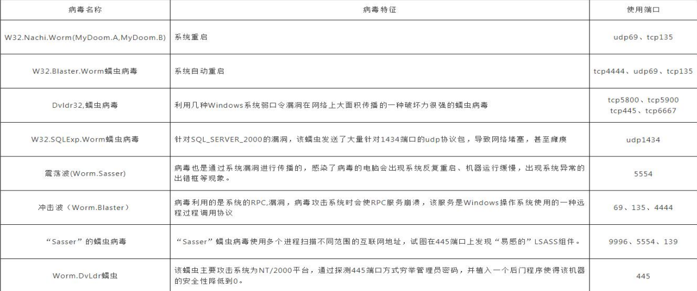
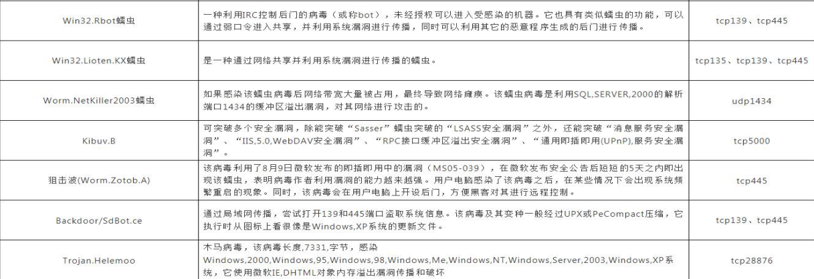
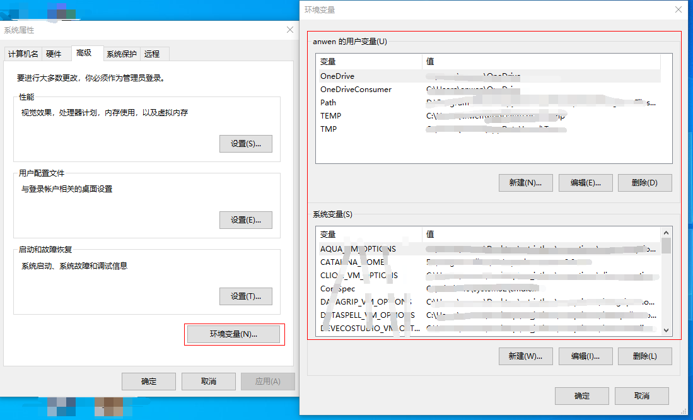
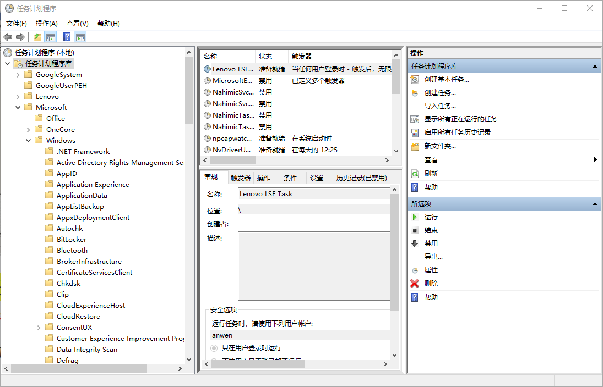

# Windows

## 一、排查

### 1，文件排查

1）开机启动项

`开始 -> 运行 -> msconfig`

2）temp目录下有无异常文件

C:\Windows\Temp

3）Recent 是系统文件夹，里面存放着你最近使用的文档的快捷方式，查看用

户 recent 相关文件，通过分析最近打开分析可疑文件：

`开始 -> 运行 -> %UserProfile%\Recent`

4）根据文件夹内文件列表时间进行排序，查找可疑文件。当然也可以搜索指

定日期范围的文件及文件

5）查看文件时间，创建时间、修改时间、访问时间

### 2，进程排查

1）netstat -ano 查看目前的网络连接，定位可疑的 ESTABLSHED，netstat 显示网络连接、路由表和接口信息；

```bash
## 参数说明
-a 显示所有网络连接、路由表和网络接口信息
-n 以数字形式显示地址和端口号
-o 显示与每个连接相关的所属进程ID
-r 显示路由表
-s 显示按协议统计信息、默认地、显示IP
```

常见的状态说明：

```bash
LISENING  # 侦听状态
ESTABLSHED # 建立连接
CLOSE_WAIT # 对方主动关闭连接或网络异常连接中断
```

示例命令：`netstat -ano | findstr ESTABLISHED`



2）根据 netstat 定位出的 pid，再通过tasklist 命令进程定位 tasklist 显示运行在本地或远程计算机上的所有进程：

```bash
tasklist | findstr 8596
verge-mihomo.exe              8596 Console                    1     26,428 K
```

3）根据 wmic process 获取进程的全路径【任务管理器也可以定位到进程路径】

```bash
C:\Users\anwen>wmic process | findstr "verge-mihomo.exe"
verge-mihomo.exe                     "\\?\D:\Program Files\Systools\Clash Verge\verge-mihomo.exe" -d C:\Users\anwen\AppData\Roaming\io.github.clash-verge-rev.clash-verge-rev -f C:\Users\anwen\AppData\Roaming\io.github.clash-verge-rev.clash-verge-rev\clash-verge.yaml -ext-ctl-pipe \\.\pipe\verge-mihomo
```

或者在任务管理器里右键进程打开文件所在位置。



很多种类的病毒都依赖网络进行传播和复制，并感染局域网中的大量终端。可以通过开放端口进行分析，有助于病毒对象的确认；





### 3，系统信息排查

1）查看环境变量的设置

【我的电脑】——》【属性】——》【高级系统设置】——》【高级】——》【环境变量】



**排查内容**：temp 变量的所在位置的内容；后缀映射 PATHEXT 是否包含有非windows 的后缀；有没有增加其他的路径到 PATH 变量中(对用户变量和系统变量都要进行排查)；

2）Windows计划任务

【程序】——》【附件】——》【系统工具】——》【任务计划程序】

```powershell
## 开始 - 运行 - taskschd.msc
```



3）Windows账号信息，如隐藏账号等...

```bash
开始 - 运行 - compmgmt.msc - 本地用户和组 - 用户 
（用户名以 $ 结尾的为隐藏用户，如 admin$）
```

```bash
# 
C:\Users\anwen>net user

\\LAPTOP-7197L898 的用户帐户

-------------------------------------------------------------------------------
Administrator            anwen                    DefaultAccountDefaultAccount

Guest                    WDAGUtilityAccount


## 用户说明
# WDAGUtilityAccount
主要服务于 Windows Defender Application Guard (WDAG) 这一安全功能，WDAG是Windows 10（版本1709及更高）和Windows 11中一项基于虚拟化的安全功能，主要用于Microsoft Edge浏览器；

# DefaultAccount 默认系统管理账户
这是一个用户中立的账户，从windows10 版本 1607 开始引入，它被设计用来运行那些与具体用户无关、或者需要服务多个用户的系统进程。
主要用于运行多用户应用（MUMA apps），这类应用在Xbox等共享设备上很常见，他们会一直运行并相应用户的登录和的退出，而不是依附于某个特定的用户。
状态与建议：在桌面版Windows上，此账户默认是禁用的。它由系统管理，建议保持其默认状态，不要尝试删除或修改。
```

若要查看某个用户的详细信息

```bash
net user 【username】
```

------

查找隐藏用户

(1)方式一：终端命令行

```bahs
wmic useraccount get name,SID
```

(2)方式二：注册表

打开注册表编辑器：win + R ，执行regedit

定位到 SAM 项，在左侧导航到 `HKEY_LOCAL_MACHINE\SAM\SAM`

获取权限：右键点击 SAM 项，选择“权限”，为当前管理员用户（如Administrator），勾选 完全控制，确定后关闭并重新打开注册表编辑器。

查看隐藏用户：重新导航到 `HKEY_LOCAL_MACHINE\SAM\SAM\Domains\Account\Users\Names` 。这个列表里显示的就是系统中所有用户，包括隐藏账户。

(3)计算机管理界面

右键点击此电脑，选择“管理”；

在左侧导航到“本地用户和组” -> “用户”。

查找可疑账户：在右侧列表中查找所有账户，特别是带有 $ 结尾的（如 admin$）

4）查看当前用户的会话

比如查看是否有人使用远程终端登录服务器；

```powershell
C:\Users\anwen>query user
 用户名                会话名             ID  状态    空闲时间   登录时间
>anwen                 console             1  运行中      无     2026/7/30 19:55


C:\Users\anwen>query session
 会话名            用户名                   ID  状态    类型        设备
 services                                    0  断开
>console           anwen                     1  运行中


# 立即将用户踢出当前会话
logoff 【ID】
```

