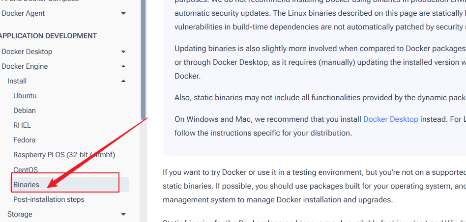
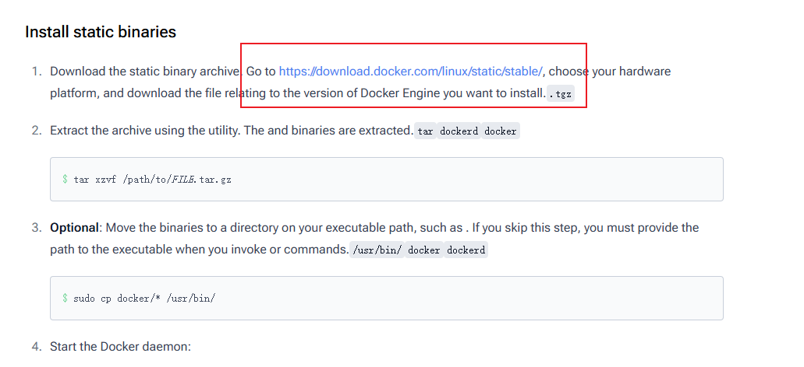
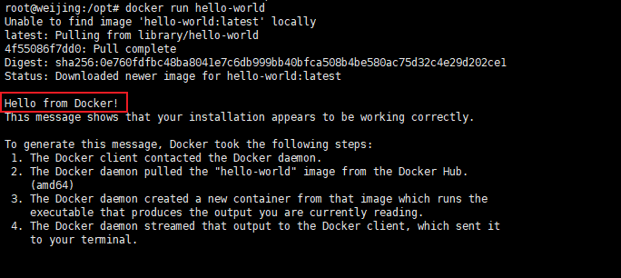

# Linux

## 1，安装

选择二进制安装



下载对应主机版本docker-engine，本文档系统版本为`Ubuntu22.04`，Docker版本`28.5.2`

https://download.docker.com/linux/static/stable/



安装lszrz用来传输文件

```bash
apt install lrzsz
rz -E
```

解压文件

```bash
tar -zxvf docker-28.5.2.tgz
```

此时我们的文件夹下会多一个docker文件夹

```bash
cp docker/* /usr/bin/
```

启动docker守护进程

```bash
dockerd &
```

验证是否安装成功

```bash
systemctl status docker
```

打印如下内容表示Docker安装正确。



## 2，配置为系统服务

```bash
# 找到dockerd的进程ID
ps aux | grep dockerd | grep -v grep

# 使用kill命令停止该进程
sudo kill 3113

# 创建服务单元文件
vim /etc/systemd/system/docker.service
```

添加以下内容

```bash
[Unit]
Description=Docker Application Container Engine
Documentation=https://docs.docker.com
After=network-online.target docker.socket firewalld.service
Wants=network-online.target
Requires=docker.socket

[Service]
Type=notify
# 指定dockerd二进制文件的路径
ExecStart=/usr/bin/dockerd -H fd://
ExecReload=/bin/kill -s HUP $MAINPID
LimitNOFILE=1048576
LimitNPROC=infinity
LimitCORE=infinity
TasksMax=infinity
TimeoutStartSec=0
Delegate=yes
KillMode=process
Restart=on-failure
StartLimitBurst=3
StartLimitInterval=60s

[Install]
WantedBy=multi-user.target
```

```bash
# 创建Socket单元文件
vim /etc/systemd/system/docker.socket
```

添加以下内容：

```bash
[Unit]
Description=Docker Socket for the API
PartOf=docker.service

[Socket]
# 指定Docker API监听的socket文件路径
ListenStream=/var/run/docker.sock
SocketMode=0660
SocketUser=root
# 这里可以遵循官方标准配置
# 即SocketGroup=docker
SocketGroup=root

[Install]
WantedBy=sockets.target
```

验证并启动服务

```bash
# 1. 重新加载所有服务文件
# 如果你上面SocketGroup=docker，这里需要格外执行groupadd docker
systemctl daemon-reload

# 2. 设置Docker服务开机自启
systemctl enable docker.service
## Created symlink /etc/systemd/system/multi-user.target.wants/docker.service → /etc/systemd/system/docker.service.

# 3. 启动Docker服务
systemctl start docker.service

# 4. 验证docker状态
systemctl status docker.service
```

## 3，使用国内镜像

```bash
# 创建配置目录
mkdir /etc/docker && chmod 755 /etc/docker

# 编辑文件
vim /etc/docker/daemon.json

## 添加如下内容
{
    "registry-mirrors": [
        "https://docker.xuanyuan.me"
    ]
}
```

```bash
## 重新加载配置
systemctl daemon-reload

## 重启docker
systemctl restart docker

## 验证配置结果
docker info

## 可以看到有个如下信息
...
...
 Registry Mirrors:
  https://docker.xuanyuan.me/
...
...
```


