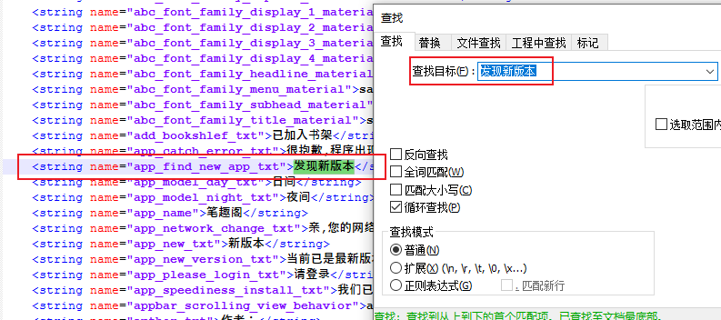
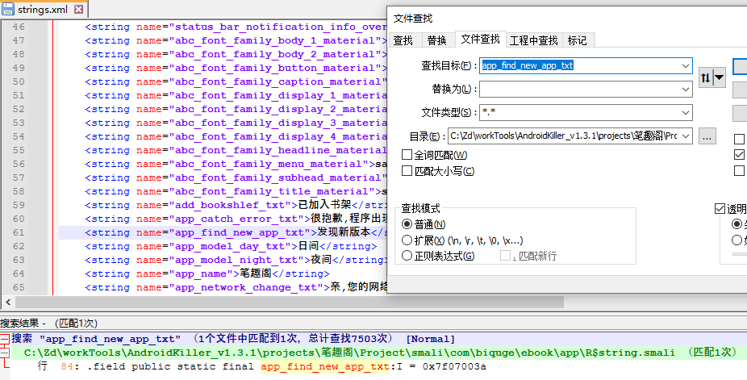
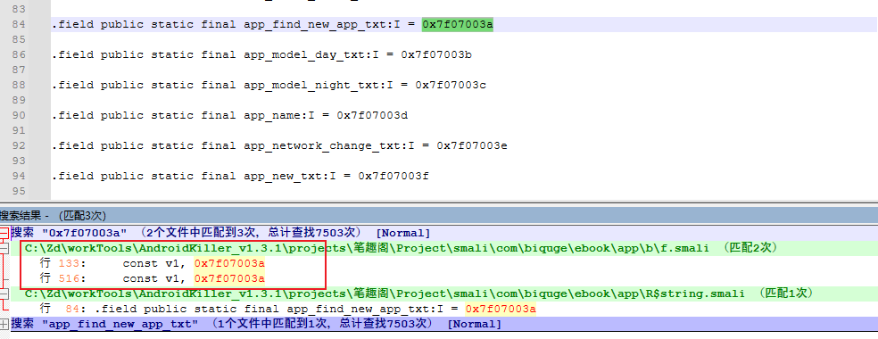
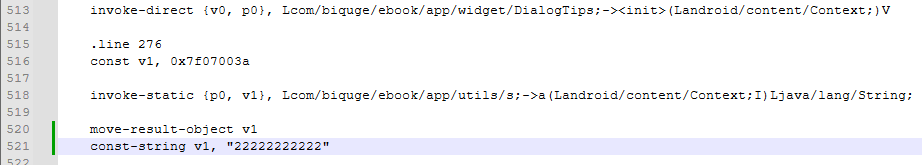
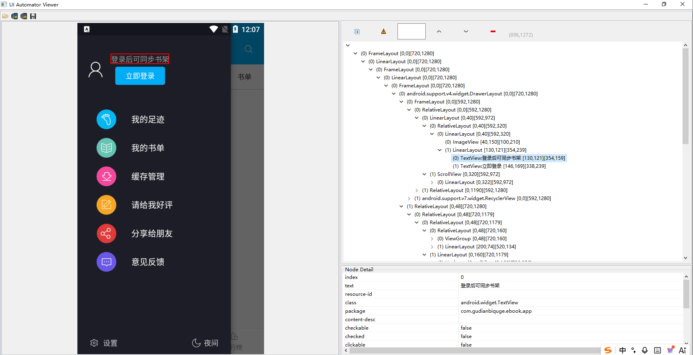
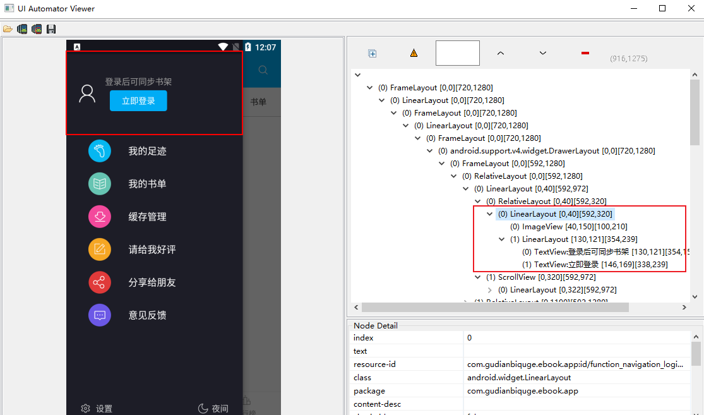

# 一，环境准备
## 1，AndroidKiller介绍
配置Java环境

<!-- 这是一张图片，ocr 内容为： -->


将xxx.apk文件拖至软件中进行反编译

<!-- 这是一张图片，ocr 内容为： -->


编译会.apk文件

<!-- 这是一张图片，ocr 内容为： -->


<!-- 这是一张图片，ocr 内容为： -->


通过<font style="color:#df2a3f;">adb</font>自动识别并连接本地安卓虚拟机

<!-- 这是一张图片，ocr 内容为： -->


## 2，将adb加入环境变量
<!-- 这是一张图片，ocr 内容为： -->


加入到path变量

<!-- 这是一张图片，ocr 内容为： -->


<!-- 这是一张图片，ocr 内容为： -->


通过adb安装软件

```shell
C:\Users\haha>adb install C:\WorkDir\Tools\mobile\AndroidKiller_v1.3.1\projects\test_1.0\Bin\test_1.0_killer.apk
1991 KB/s (748967 bytes in 0.367s)
Success
```

# 二、Smali语法讲解
## 1，什么是Smali？
Smali，Baksmali分别是指安卓系统里的Java虚拟机（Dalvik）所使用的一种。dex格式文件的汇编器，反汇编器。其语法是一种宽松格式的Jasmin、dedexer语法，而且它实现了.dex格式所有功能（注释，调试信息，线路信息等）

当我们对APK文件进行反编译后，便会生成此类的文件。其中在Davlik字节码中，寄存器都是32位的，能够支持任何类型，64位类型（Long、Double）用2个寄存器表示；Dalvik字节码有两种类型：原始类型；引用类型（包括对象和数组）

## 2，数据类型
```shell
B --- byte
C --- Char
D --- Double
F --- Float
I --- int
L --- Long
S --- Short
V --- Void
Z --- boolean
[xxx --- array	# 在基本类型前加上前中括号[ 即表示该类型数组
  [B  表示byte数组
  [i	表示int数组
Lxxx/yyy --- object		# 如果是对象则以L开头，格式是Lpackagename/objectname
    Ljava/lang/String 表示String对象，其中java/lang表示java.lang包，String是该包的一个对象
    类对象表示为LpackageName/objectName;类对象中的内部类则使用 "$"] 来连接
```

## 3，函数定义
Func-Name(Para-Type1 Para-Type2 Para-Type3...) Return-Type

参数与参数之间没有任何间隔；如

Hello()V

表示：void hello()

Hello(III)Z

表示：Boolean hello(int,int,int)

```shell
# Hello(Z [I [I Ljava/lang/String; L)		Ljava/lang/String;
# 函数名Hello，返回值String
String Hello(Boolean,int[],int[],String,long)
```

## 4，关键词
```shell
.field private isFlag:z	# 定义变量，private修饰符，isFlag表变量名
.method		# 方法
.parameter	# 方法参数
.prologue		# 方法开始
.line 123		# 此方法位于第123行
invoke-super	# 调用父函数
const/hign16 v0,0x7fo3	# 把0x7fo3赋值给v0
invoke-direct		# 调用函数
return-void		# 函数返回void
.end method		# 函数结束
new-instance	# 创建实例
iput-object		# 对象赋值
iget-object		# 调用对象
invoke-static		# 调用静态函数
```

```java
.class public Lcom/isi/testapp/MainActivity;
.super Landroid/app/Activity;
.source "MainActivity.java"


# instance fields
.field btn:Landroid/widget/Button;

.field et:Landroid/widget/EditText;


# direct methods
.method public constructor <init>()V
.locals 0

.prologue
.line 13
invoke-direct {p0}, Landroid/app/Activity;-><init>()V

return-void
.end method


# virtual methods
.method protected onCreate(Landroid/os/Bundle;)V
.locals 2
.param p1, "savedInstanceState"    # Landroid/os/Bundle;

.prologue
.line 20
invoke-super {p0, p1}, Landroid/app/Activity;->onCreate(Landroid/os/Bundle;)V

              .line 21
              const/high16 v0, 0x7f030000

              invoke-virtual {p0, v0}, Lcom/isi/testapp/MainActivity;->setContentView(I)V

              .line 22
              const v0, 0x7f080001

              invoke-virtual {p0, v0}, Lcom/isi/testapp/MainActivity;->findViewById(I)Landroid/view/View;

move-result-object v0

check-cast v0, Landroid/widget/EditText;

iput-object v0, p0, Lcom/isi/testapp/MainActivity;->et:Landroid/widget/EditText;

.line 23
const v0, 0x7f080002

invoke-virtual {p0, v0}, Lcom/isi/testapp/MainActivity;->findViewById(I)Landroid/view/View;

move-result-object v0

check-cast v0, Landroid/widget/Button;

iput-object v0, p0, Lcom/isi/testapp/MainActivity;->btn:Landroid/widget/Button;

.line 24
iget-object v0, p0, Lcom/isi/testapp/MainActivity;->btn:Landroid/widget/Button;

new-instance v1, Lcom/isi/testapp/MainActivity$1;

invoke-direct {v1, p0}, Lcom/isi/testapp/MainActivity$1;-><init>(Lcom/isi/testapp/MainActivity;)V

invoke-virtual {v0, v1}, Landroid/widget/Button;->setOnClickListener(Landroid/view/View$OnClickListener;)V

.line 41
return-void
.end method
```

## 5，Smali条件跳转
<!-- 这是一张图片，ocr 内容为： -->


<!-- 这是一张图片，ocr 内容为： -->


## 6，Smali类的信息
```java
.class public Lcom/aaaaa;	# 它是com.aaaaa这个package下的一个类
.super Lcom/bbbbb;			# 继承自com.bbbbb这个类
.source "ccccc.java"		# 这是一个由ccccc.java编译得到的smali文件
```

## 7，类中成员变量表示和操作
<!-- 这是一张图片，ocr 内容为： -->


## 8，成员变量指令简析
<!-- 这是一张图片，ocr 内容为： -->


## 9，函数调用
<!-- 这是一张图片，ocr 内容为： -->


<!-- 这是一张图片，ocr 内容为： -->


<!-- 这是一张图片，ocr 内容为： -->


```java
# virtual methods
# .method方法开头，方法名是m，返回类型是String，()为空无传参
.method protected m()Ljava/lang/String;
    ### 1表示这个方法中使用寄存器的数量
    .locals 1
    ### 将"DesktopCa1"赋值给v0寄存器
    const-string v0, "DesktopCa1"
    ### 返回的是一个对象v0
    return-object v0
# .end method方法结束
.end method
```

Smali在进行逻辑运算时，使用的是寄存器；

假如：a+b = ab

```java
a -> v0
b -> v1
a + b -> v0 + v1
```

**Smali返回结果的操作**

在Java代码中调用函数和返回函数结果可以用一条语句完成，而在Smali里则需要分开来完成，在使用上述指令后，如果调用的函数返回非void，那么还需要用到move-result（返回基本数据类型）和move-result-object（返回对象）指令；

```java
const-string v0,"Eric"
invoke-static {v0},Lcmb/pbi;->t(Ljava/lang/String;)Ljava/lang/String;
move-result-object v2
```

v2保存的就是调用t方法返回的String字符串

**分析实例-if调用**

```java
.method private ifRegistered()Z
    .locals 2	// 函数中存在两个寄存器
    .prolgue
    const/4 v0,0x1	// v0赋值为1
    .local v0,tempFlag:Z
    if-eqz v0,:cond_0	// 判断v0是否等于0，等于0则跳到cond_0执行
    const/4 v1,0x1	// 符合条件分支
    :goto 0	// 标签
    return v1	// 返回v1的值
    :cond_0	// 标签
    const/4 v1,0x0	// cond_0分支
    goto:goto_0		// 跳到goto_0执行 即返回v1的值 这里可以改成return v1 也是一样的
.end method
```

## 10，登录代码示例
```java
# virtual method
.method public check(Ljava/lang/String;Ljava/lang/String;)V
    .locals 2
    .param p1,"name"
    .param p2,"pass"

    .prologue	#代表这个方法要开始了
    const/4 v1,0x0

    .line 28
    const-string v0, "hfdcxy"	# v0 = hfdcxy
    ### 把p1和v0进行equals函数对比
    invoke-virtual {p1,v0}, Ljava/lang/String;->equals(Ljava/lang/Object;)Z
    ### 上个函数结果给v0
    move-result v0

    ### 如果v0 = 0，就执行cond_0后面的语句，否则继续往下执行
    if-eqz v0, :cond_0		# v0 = 1234
    const-string v0, "1234"
    ### 把p2和v0进行equals函数对比
    invoke-virtual {p2,v0}, Ljava/lang/String;->equals(Ljava/lang/Object;)Z
    ### 上个函数的执行结果放到v0中
    move-result v0;
    if-eqz v0, :cond_0
```

# 三、安卓常见反编译工具
## 1，环境与工具概述
**环境设备**：电脑（Java、Python、Ecplise等环境）、手机（ROOT）、USB（数据线）

**PC工具**：Java、Python、Ecplise、AndroidSDK、Apktool、dex2jar、JD-GUI、AndroidKiller、Fiddler/BurpSuit、Ida Pro、SqliteBrower、010Editor等

**终端工具**：R.E.Explorer、inject、界面劫持工具等...

## 2，AndroidKiller
批量编译

<!-- 这是一张图片，ocr 内容为： -->


字符串（展示所有带双引号的部分）

<!-- 这是一张图片，ocr 内容为： -->


显示一个类里的所有函数

<!-- 这是一张图片，ocr 内容为： -->


查看方法在哪被引用

<!-- 这是一张图片，ocr 内容为： -->


在指定位置插入代码

<!-- 这是一张图片，ocr 内容为： -->


中文不乱码机制

<!-- 这是一张图片，ocr 内容为： -->


## 3，jadx
不能修改（反编译成Smali），只能做源码分析

<!-- 这是一张图片，ocr 内容为： -->


## 4，Jeb
<!-- 这是一张图片，ocr 内容为： -->


Jeb字符串搜索

<!-- 这是一张图片，ocr 内容为： -->


## 5，IDA Pro
## 6，MT管理器
## 7，Xposed框架
### 1）辅助插件
Inspeckage，

## 8，Drozer
对App进行安全测试

## 9，个人项目GDA
官网：[http://www.gda.wiki:9090/](http://www.gda.wiki:9090/)

官方教程：[https://zhuanlan.zhihu.com/p/28354064](https://zhuanlan.zhihu.com/p/28354064)

<!-- 这是一张图片，ocr 内容为： -->


## 10，Ghidra
# 四、Android程序破解示例
## 1，环境准备
尝试破解登录功能

<!-- 这是一张图片，ocr 内容为： -->
<!-- 这是一张图片，ocr 内容为： -->


## 2，渗透思路
**1）敏感信息泄露**

使用jadx分析Java代码

<!-- 这是一张图片，ocr 内容为： -->


这里看到只有一个界面，不会产生界面切换，类的名字是：hfdcxy.com.myapplication.MainActivity

```bash
<activity android:name="hfdcxy.com.myapplication.MainActivity">
    <intent-filter>
        <action android:name="android.intent.action.MAIN"/>
        <category android:name="android.intent.category.LAUNCHER"/>
    </intent-filter>
</activity>
```

`MainActivity.java`

<!-- 这是一张图片，ocr 内容为： -->


2）使用AndroidKiller修改源代码，将“登录成功”的Unicode编码替换到原本登录失败的编码上（只是显示上发生变化，用处不大）

<!-- 这是一张图片，ocr 内容为： -->


## 3，酷我音乐破解Demo
音效要钱，我们先记住这个关键句

<!-- 这是一张图片，ocr 内容为： -->


对Android在引用字符串的时候，

1、直接将字符串写在代码里面；

2、将字符串封装为一个资源索引，存到res目录下；

<!-- 这是一张图片，ocr 内容为： -->


我们可以进行全局搜索

<!-- 这是一张图片，ocr 内容为： -->


使用notepad查找

<!-- 这是一张图片，ocr 内容为： -->


<!-- 这是一张图片，ocr 内容为： -->


<!-- 这是一张图片，ocr 内容为： -->


接下来我们尝试再里搜索dialog_content_tips_use_car_effect

<!-- 这是一张图片，ocr 内容为： -->


继续搜索0x7f08001d

<!-- 这是一张图片，ocr 内容为： -->


代码成功到逻辑代码，我们开始分析smali

```bash
    if-nez v0, :cond_0		#### 让这个跳转成功
    #### v0 note equal zero
    #### 如果v0不等于0，就跳转到cond_0绕过VIP监测弹窗
    iget-object v0, p0, Lcn/kuwo/mvp/presenter/CarSoundEffectSettingPresenter;->b:Landroid/content/Context;

    const-string v1, "\u63d0 \u793a"

    iget-object v2, p0, Lcn/kuwo/mvp/presenter/CarSoundEffectSettingPresenter;->b:Landroid/content/Context;

    invoke-virtual {v2}, Landroid/content/Context;->getResources()Landroid/content/res/Resources;

    move-result-object v2

    const v3, 0x7f08001d

    invoke-virtual {v2, v3}, Landroid/content/res/Resources;->getString(I)Ljava/lang/String;

    move-result-object v2

    const-string v3, "\u7acb\u5373\u5f00\u901a"		#### 立即开通
```

我们手动复制让v0为1

```bash
const v0, 0x1
```

<!-- 这是一张图片，ocr 内容为： -->


我们继续修改另一个出现 `0x7f08001d` 的地方

<!-- 这是一张图片，ocr 内容为： -->


重新编译安装，上去测试

此时我们可以随意切换音效

<!-- 这是一张图片，ocr 内容为： -->


继续破解装扮，根据之前的经验简化过程；

<!-- 这是一张图片，ocr 内容为： -->


首先直接在strings.xml中搜索关键字“专属皮肤特权”

    <string name="dialog_content_tips_use_pay_skin">"开通车载VIP

即享专属汽车皮肤特权"</string>

接下来找id，通过name去public.xml中找

<!-- 这是一张图片，ocr 内容为： -->


0x7f08001e

接下来我们再用直接的方式搜索id就可以了。

将 `if-nez v0, :cond_1` 改为 `goto`

<!-- 这是一张图片，ocr 内容为： -->


> 破解付费歌单
>

<!-- 这是一张图片，ocr 内容为： -->


找到图示文件中的函数e()

<!-- 这是一张图片，ocr 内容为： -->


<!-- 这是一张图片，ocr 内容为： -->


## 4，总结
1）找线索。包括字符串、事件（按钮，网络请求，判断）..

2）定位到关键的地方；

3）对于修改来说，非常常见的方式是赋值、改跳，需要进行函数调用的、还有一些自定义添加逻辑代码；

逻辑推理：

从开发者的角度，会有一个专门用来识别用户是不是VIP的通用的地方A

1，换皮肤的时候，调用A来判断是不是会员；

2，设置音效的时候，调用A来判断是不是会员；

3，当听付费歌曲的时候，调用A来判断是不是会员；

所以只需要修改掉A就OK

## 1，去广告示例

> 去除更新弹窗





查找结果中的id，这里定位到两处。



分析代码121~173行，返回值类型为void，不需要返回东西，所以我们直接删除它的执行代码不让它执行里面的逻辑。

```java
.method private static a(Landroid/content/Context;Ljava/lang/String;)V
    .locals 3

    .prologue
### put操作
	...
    ...
    return-void
.end method
```

但是改完了并没有起到什么效果，接下来通过修改字符串进行调试：



经验证，此处的v1是升级弹窗的标题，并且需要同时注释掉第478行和500行的代码

```bash
## if-eqz v1, :cond_0
```

然后之前的更新提示弹窗确实消失了，但是又开始显示了如下代码块的内容，我们还像之前一样删除即可；（这里教程同上面一样在字符串变量后面通过修改参数值进行了调试然后发现的）

```bash
.method private static a(Landroid/content/Context;Ljava/lang/String;)V
    .locals 3

    .prologue
### put操作
	...
    ...
    return-void
.end method
```

## 2，去除登录功能

> 通过隐藏布局实现

布局文件：`res/layout/`	借助工具platform-tools中的uiautomatorviewer（需使用jdk8，高版本无法启动）



找到登录窗口的控件位置



可以看到下面的布局id：`function_navigation_login_layout`

在res布局文件中搜索这个ID，课件里给的搜索不到（什么垃圾玩意）

找到布局代码，将android:layout_width和height改成0.0dip。通过设置控件的宽高达到隐藏效果

# 五、

