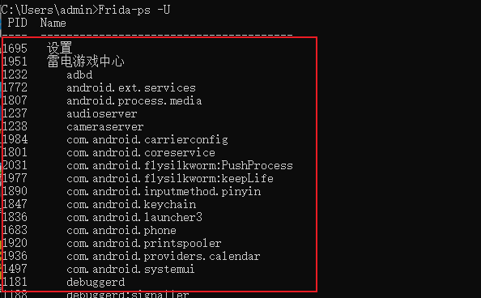

```bash
pip install frida==16.7.14
pip install frida-tools=13.7.0
```

将frida-server推送到移动设备

```bash
adb push ./frida-server-16.7.14-android-x86 /data/local/tmp

## 简化文件名
mv ./frida-server-16.7.14-android-x86 ./frida-server

## 授予Root权限
chmod 777 ./frida-server

## 启动服务
./frida-server
## 将服务挂起
./frida-server &
[1] 2240
```

验证服务状态

```cmd
C:\Users\admin>Frida-ps -U
```

