# 一、基础语法

## 1，Hello Golang!

编辑器版本Jebrains GoLang 2022.2.6

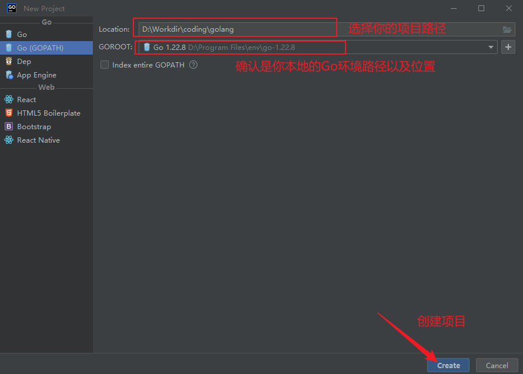

```go
// 如果一个程序要直接运行（生成可执行文件），必须声明为 package main。
package main

// 引入标准库中的 fmt 包，它提供了格式化输入输出函数。
/**
可以通过花括号导入多个包
导入后通过 包名.函数名 调用，例如 fmt.Println
import (
    "fmt"
    "math"
)
*/
import "fmt"

func main() {
	fmt.Println("Hello Golang!")
}
```

20260606补充：关于 Golang Jebrians IDEA自动删除未使用的包问题解决。

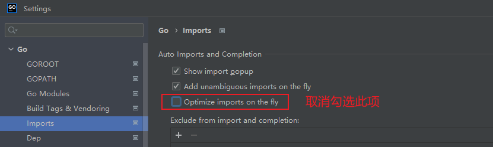

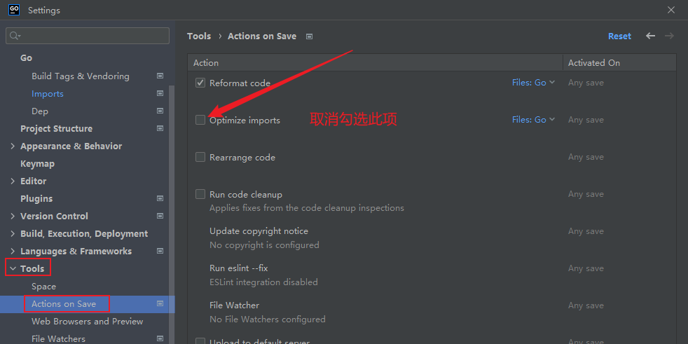 

## 2，变量声明

Go语言的基本类型

```bash
1,布尔型bool
	取值 true 或 false
2,数字类型
	整数 int(32bit/64bit),int8,int16,int32,int64
	uint,uint8,uint16,...,uintptr(足够存储指针的整数)
	注：byte 是 uint8的别名，rune是int32的别名
3，浮点数
	float32,float64
4，复数
	complex64,实部 + 虚部均为float32
	complex128,实部 + 虚部均为float64
5，字符串
	不可变的字节序列，默认UTF-8编码
```

当一个变量被声明之后，系统自动赋予它该类型的零值：int 为 0，float 为 0.0，bool 为 false，string 为空字符串，指针为 nil 等。所有的内存在 Go 中都是经过初始化的。

变量的命名规则遵循骆驼命名法，即首个单词小写，每个新单词的首字母大写，例如：numShips 和 startDate 。

Go语言变量声明标准格式是：

```go
var 变量名 变量类型
```

将变量放到一起定义，方便维护管理

```go
var (
	a int
	b string
	c []float32
	d func() bool
	e struct {
		x int
	}
)
```

除 var 关键字外，还可使用更加简短的变量定义和初始化语法。名字 := 表达式

需要注意的是，简短模式（short variable declaration）有以下限制：

1）定义变量，同时显式初始化。
2）不能提供数据类型。
3）只能用在函数内部。

```go
...
...
// 简短格式
func test() {
	x := 100
	a, s := 1, "abc"
	fmt.Println(x)
	fmt.Println(a)
	fmt.Println(s)
}
func main() {
	test()
	/**
        100
        1
        abc
	*/
}
```

```go
// var 变量名 类型 = 数值
// 由于 100 与 int 均为 int类型，可简化为 var sum = 100
// var sum int = 100
var sum = 100


// 定义整数与浮点数
var attack = 40
var defence = 20
var damageRate float32 = 0.17
var damage = float32(attack-defence) * damageRate
```

短变量声明

```go
func fun02() {
	// 短变量声明并初始化
	//var hp int
	// 这是Go语言的推导声明写法，编译器会自动根据右值类型推断出左值的对应类型。 推导声明写法的左值变量必须是没有定义过的变量。若定义过，将会发生编译错误。
	hp := "nihao"
	fmt.Println(hp)
}
```

短变量的其他应用

```go
	//net.Dial 提供按指定协议和地址发起网络连接，这个函数有两个返回值，一个是连接对象（conn），一个是错误对象（err）。
	con, err1 := net.Dial("tcp", "127.0.0.1:8080")
	fmt.Println(con, err1)

	// 标准写法
	var conn net.Conn
	var err error
	conn, err = net.Dial("tcp", "127.0.0.1:8080")
	fmt.Println(conn, err)
```

## 3，Go语言的多重赋值

多重赋值时，变量的左值和右值按从左到右的顺序赋值。

```go
...
...
func func03() {
	var a int = 100
	var b int = 200

	a, b = b, a
	fmt.Println(a, b) // 200 100
}

func main() {
	func03()
}
```

## 4，匿名变量

在编码过程中，可能会遇到没有名称的变量、类型或方法。这样做可以极大地增强代码的灵活性，这些变量被统称为匿名变量。

匿名变量的特点是一个下划线 “_” ，"\_" 本身就是个特殊的标识符，被称为空白标识符。它可以像其他标识符那样用于变量的声明或赋值（任何类型都可以赋值给它），但任何赋给这个标识符的值都将被抛弃，因此这些值不能在后续的代码中使用，也不可以使用这个标识符作为变量对其它变量进行赋值或运算。使用匿名变量时，只需要在变量声明的地方使用下画线替换即可。例如：

```bash
...
...
// ========== 4、匿名变量 ========== //
// 匿名变量不占用内存空间，不会分配内存。匿名变量与匿名变量之间也不会因为多次声明而无法使用。
// GetData每次调用都会返回两个值： 100 200
func GetData() (int, int) {
	return 100, 200
}
func main() {
	//fun02()
	//func03()

	// 只需要获取第一个返回值，所以将第二个返回值的变量设为下画线（匿名变量）。
	a, _ := GetData()
	// 将第一个返回值的变量设为匿名变量。
	_, b := GetData()
	fmt.Println(a, b) // 100 200
}
```

## 5，Go的变量作用域

局部变量

```go
// 根据变量定义的位置不同大致分为一下三种变量：
/*
函数内定义的变量称为局部变量
函数外定义的变量称为全局变量
函数定义中的变量称为形式参数
*/

func main() {
	// 声明局部变量 a b 并赋值
	var a int = 3
	var b int = 4
	c := a + b
	fmt.Printf("a = %d,b = %d,c = %d\n", a, b, c) // a = 3,b = 4,c = 7
}
```

全局变量

```go
...
...
var c int

func main() {
	var a, b int
	a = 3
	b = 4
	c = a + b
	fmt.Printf("a = %d,b = %d,c = %d\n", a, b, c) // a = 3,b = 4,c = 7
}
```

形式参数

```go
// 在定义函数时函数名后面括号中的变量叫做形式参数，简称形参
...
...
// 全局变量a
var a int = 13

func main() {
	// 布局变量 a b
	var a int = 3
	var b int = 4
	fmt.Printf("main() 函数中 a = %d\n", a)  // main() 函数中 a = 3
	fmt.Printf("main() 函数中的 b = %d\n", b) // main() 函数中的 b = 4
	c := sum(a, b)
	fmt.Printf("main() 函数中的 c = %d\n", c) // main() 函数中的 c = 7
}

func sum(a, b int) int {
	fmt.Printf("sum() 函数中 a = %d\n", a)  // sum() 函数中 a = 3
	fmt.Printf("sum() 函数中的 b = %d\n", b) // sum() 函数中的 b = 4
	num := a + b
	return num
}
```

## 6，再述数据类型

**整数类型**

```bash
## Go语言整数类型要点

### 1. 基本分类
- **有符号整数**：`int8`, `int16`, `int32`, `int64`
- **无符号整数**：`uint8`, `uint16`, `uint32`, `uint64`

### 2. 特殊整型
- `int` / `uint`：平台相关，32或64位，速度最快，通用推荐
- `rune`：等价`int32`，表示Unicode码点
- `byte`：等价`uint8`，表示原始数据
- `uintptr`：足够容纳指针，仅用于底层编程（如C交互）

### 3. 取值范围（示例）
- `int8`：-128 ～ 127
- `uint8`：0 ～ 255
- 通用公式：
  - 有符号 n-bit：`-2^(n-1)` ～ `2^(n-1)-1`
  - 无符号 n-bit：`0` ～ `2^n-1`

### 4. 重要规则
- 有符号整数采用**2的补码**表示（最高位为符号位）
- `int`/`uint` 与固定大小整型（如`int32`）**是不同的类型**，需要显式转换
- 即使大小相同（如`int`是32位），也不能直接当作`int32`使用

### 5. 使用建议
- 常规场景优先使用 `int`
- 明确大小或跨平台时使用 `int32`/`int64` 等
- 字符用 `rune`，字节数据用 `byte`
```

**哪些情况下使用 int 和 uint ?**

不关心具体字节大小，只要“能装下这个数”就行。

不能使用的场景：数据要写入硬盘文件、发送到网络、或被 C 语言解析。字节数必须固定。

“内存里随便跑用 `int`，落地跨平台用定长。”

------

**浮点类型**

Go语言提供了两种精度的浮点数 float32 和 float64，这些浮点数类型的取值范围可以从很微小到很巨大。浮点数取值范围的极限值可以在 math 包中找到：

```bash
常量 math.MaxFloat32 表示 float32 能取到的最大数值，大约是 3.4e38；
常量 math.MaxFloat64 表示 float64 能取到的最大数值，大约是 1.8e308；
float32 和 float64 能表示的最小值分别为 1.4e-45 和 4.9e-324。
```

float32精度低（约6位），算几次就容易出错，且能精确表示的整数只到1600多万；float64精度高（约15位），更稳更安全，除非你非常在意内存或性能，否则默认用 float64。

```go
var f float32 = 16777216 // 1 << 24
fmt.Println(f == f+1)    // "true"!
```

浮点数在声明的时候可以只写整数部分或者小数部分，像下面这样：

```go
const e = .71828 // 0.71828
const f = 1.     // 1
```

很小或很大的数最好用科学计数法书写，通过 e 或 E 来指定指数部分：

```go
const Avogadro = 6.02214129e23  // 阿伏伽德罗常数
const Planck   = 6.62606957e-34 // 普朗克常数
```

用 Printf 函数打印浮点数时可以使用“%f”来控制保留几位小数

```go
package main

import (
    "fmt"
    "math"
)

func main() {
    fmt.Printf("%f\n", math.Pi) // 3.141593
    fmt.Printf("%.2f\n", math.Pi) // 3.14
}
```

------

**Go语言复数**

在计算机中，复数是由两个浮点数表示的，其中一个表示实部（real），一个表示虚部（imag）。Go语言中复数的类型有两种，分别是  `complex128（64 位实数和虚数）`和 `complex64（32 位实数和虚数）`，其中`complex128 为复数的默认类型`。复数的值由三部分组成 RE + IM + i，其中 RE 是实数部分，IM 是虚数部分，RE 和 IM 均为 float 类型，而最后的 i 是虚数单位。

```go
// 声明复数的语法如下：
var name complex = complex(x,y)
```

其中 name 为复数的变量名，complex128 为复数的类型，“=”后面的 complex 为Go语言的内置函数用于为复数赋值，x、y 分别表示构成该复数的两个 float64 类型的数值，x 为实部，y 为虚部。

上面的声明语句也可以简写为下面的形式：

```go
name := complex(x, y)
```

对于一个上面的复数可以用两个内置的函数构建复数，并使用 real(z) 和 imag(z) 函数返回复数的实部 和 虚部：

```go
// 使用内置的 complex 函数构建复数，并使用 real 和 imag 函数返回复数的实部和虚部：

var x complex128 = complex(1,2) // 1+2i
var y complex128 = complex(1,2) // 3+4i
fmt.Println(x*y)	// (-5 + 10i)
fmt.Println(real(x*y))	// -5
fmt.Println(imag(x*y))	// 10
```

复数也可以用 == 和 != 进行相等比较，只有两个复数的实部和虚部都相等的时候它们才是相等的。

## 7，实例：输出正弦函数（Sin）图形

```go
package main

import (
	"fmt"
	"math"
)

func main() {
	const (
		width  = 80          // 图像宽度（列数）
		height = 20          // 图像高度（行数）
		xStart = 0.0         // X轴起始弧度
		xEnd   = 2 * math.Pi // X轴结束弧度（一个完整周期）
	)

	// 预计算每个 X 对应的 Sin 值
	yValues := make([]float64, width)
	for i := 0; i < width; i++ {
		x := xStart + (xEnd-xStart)*float64(i)/float64(width-1)
		yValues[i] = math.Sin(x)
	}

	// 找出 Y 的最大值和最小值（用于归一化）
	minY, maxY := yValues[0], yValues[0]
	for _, v := range yValues {
		if v < minY {
			minY = v
		}
		if v > maxY {
			maxY = v
		}
	}

	// 逐行打印图像（从上到下）
	for row := 0; row < height; row++ {
		// 当前行对应的目标 Y 值（从上到下递减）
		targetY := maxY - (maxY-minY)*float64(row)/float64(height-1)

		// 遍历所有列，寻找离 targetY 最近的 Sin 值
		for col := 0; col < width; col++ {
			if math.Abs(yValues[col]-targetY) < (maxY-minY)/float64(height)/2 {
				fmt.Print("*")
			} else {
				fmt.Print(" ")
			}
		}
		fmt.Println()
	}
}
```

------

## 8，Go语言bool类型

一个布尔类型的值只有两种：`true` 或 `false`。if 和 for 语句的条件部分都是布尔类型的值，并且 == 和 < 等比较操作也会产生布尔型的值。

```go
var aVar = 10
aVar == 5  // false
aVar == 10 // true
aVar != 5  // true
aVar != 10 // false
```

在Go语言中，只有两个相同类型的值才可以进行比较，如果值的类型是接口（interface），那么它们也必须都实现了相同的接口。如果其中一个值是常量，那么另外一个值可以不是常量，但是类型必须和该常量类型相同。如果以上条件都不满足，则必须将其中一个值的类型转换为和另外一个值的类型相同之后才可以进行比较。

**Go语言的短路求值机制**：Go 语言在计算逻辑表达式时，会从左到右计算，一旦能确定最终结果，就不再计算右边的表达式。

```go
s != "" && s[0] == 'x'

// 1. 先计算左边，如果 s 值是空字符串，左边就是false
// 2. 短路发生：false && ??? 的结果一定就是 false（因为 and 运算符要求两边都为真），既然结果已经确定，右边的 s[0] == 'x'，根本不会执行
// 3. 安全的意义：如果 s 是空字符串，访问 s[0] 本来会导致运行时出现索引越界，但是因为短路，右边根本没有被求值，所以永远不会panic
```

对比两种写法：

| 写法                   | 当 s 为空字符串时      | 结果           |
| ---------------------- | ---------------------- | -------------- |
| s != "" && s[0] == 'x' | 左边 false，右边不执行 | 安全返回 false |
| s[0] == 'x' && s != "" | 先执行 s[0]            | 直接panic      |

同理对于 || （OR）

```go
s == "" || s[0] == 'x'
// 如果 s 是空字符串，左边为true，true || ??? 结果已经确定为 true，右边 s[0] 同样不会执行，安全
```

因为 `&&` 的优先级比 `||` 高（`&&` 对应逻辑乘法，`||` 对应逻辑加法，乘法比加法优先级要高），所以下面的布尔表达式可以不加小括号：

```go
if 'a' <= c && c <= 'z' ||
    'A' <= c && c <= 'Z' ||
    '0' <= c && c <= '9' {
    // ...ASCII字母或数字...
}
```

布尔值并不会隐式转换为数字值 0 或 1，反之亦然，必须使用 if 语句显式的进行转换：

```go
var b bool = true

func main() {
	i := 0
	if b {
		i = 1
	}
	fmt.Println(i) // 1
}
```

如果需要经常做类似的转换，可以将转换的代码封装成一个函数，如下所示：

```go
// 如果b为真，btoi返回1；如果为假，btoi返回0
func btoi(b bool) int {
    if b {
        return 1
    }
    return 0
}
```

数字到布尔型的逆转换非常简单，不过为了保持对称，我们也可以封装一个函数：

```go
var tmp any

func itob(i int) bool {
	return i != 0
}

func main() {
	tmp = itob(2)
	// 当传递的参数 != 0 时，函数返回结果为true否则为false
	fmt.Println(tmp) // true
}
```

Go语言中不允许将整型强制转换为布尔型，代码如下：

```go
var n bool = false

func main() {
	fmt.Println(int(n) * 2)

	/**
	# command-line-arguments
	.\variableDoc.go:174:18: cannot convert n (variable of type bool) to type int
	*/
}
```

布尔型无法参与数值运算，也无法与其他类型进行转换。

## 9，字符串类型

​		一个字符串是一个不可改变的字节序列，字符串可以包含任意的数据，但是通常是用来包含可读的文本，字符串是 UTF-8 字符的一个序列（当字符为 ASCII 码表上的字符时则占用 1 个字节，其它字符根据需要占用 2-4 个字节）。

​		UTF-8 是一种被广泛使用的编码格式，是文本文件的标准编码，其中包括 XML 和 JSON 在内也都使用该编码。由于该编码对占用字节长度的不定性，在Go语言中字符串也可能根据需要占用 1 至 4 个字节，这与其它编程语言如 C++ 、 Java 或者 Python 不同（Java 始终使用 2 个字节）。Go语言这样做不仅减少了内存和硬盘空间占用，同时也不用像其它语言那样需要对使用 UTF-8 字符集的文本进行编码和解码。

​		字符串是一种值类型，且值不可变，即创建某个文本后将无法再次修改这个文本的内容，更深入地讲，字符串是字节的定长数组。

------

**定义字符串**

可以使用双引号 "" 来定义字符串，字符串中可以使用转义字符来实现换行、缩进等效果，常用的转义字符包括：

```go
\n：换行符
\r：回车符
\t：tab 键
\u 或 \U：Unicode 字符
\\：反斜杠自身
```

```go
package main

import (
    "fmt"
)

func main() {
    var str = "Hello,\ngolong"
    fmt.Println(str)
}
```

一般的比较运算符（==、!=、<、<=、>=、>）是通过在内存中按字节比较来实现字符串比较的，因此比较的结果是字符串自然编码的顺序。字符串所占的字节长度可以通过函数 len() 来获取，例如 len(str)。

字符串的内容（纯字节）可以通过标准索引法来获取，在方括号 [ ] 内写入索引，索引从 0 开始计数：

字符串 str 的第 1 个字节：str[0]
第 i 个字节：str[i - 1]
最后 1 个字节：str[len(str)-1]

需要注意的是，这种转换方案只对纯 ASCII 码的字符串有效。获取字符串中某个字节的地址属于非法行为，例如 &str[i]。

```go
// 两个字符串通过 + 拼接
s := s1 + s2

## 小案例
// 字符串拼接
func main() {
	s := "hel" + "lo,"
	s += "world"
	fmt.Println(s) // hello,world
}
```

使用反引号创建多行字符串，两个反引号间的字符串将被原样赋值到 str 变量中。

```bash
var str1 = `hello，
friends，
how are you ?`	// 这里的反引号如换行到下一行，打印出来的结果就会多一行空行

var str2 = "hello，" +
	"friends," +
	"how are you ?"

func main() {
	fmt.Println(str1)
	fmt.Println("=========================")
	fmt.Println(str2)
}

// 结果如下 //
hello，
friends，
how are you ?
=========================
hello，friends,how are you ?
```

------

**const 与 var 的区别**

核心区别：const 定义的是编译期确定的常量，var 定义的是运行时可以改变的变量。

| 特性     | const                      | var                    |
| -------- | -------------------------- | ---------------------- |
| 可修改性 | 不可修改（只读）           | 可以修改               |
| 赋值时机 | 编译时确定                 | 运行时确定             |
| 作用域   | 包级或块级                 | 包级或块级             |
| 类型     | 可选类型，可以是无类型常量 | 必须有具体类型或可推断 |

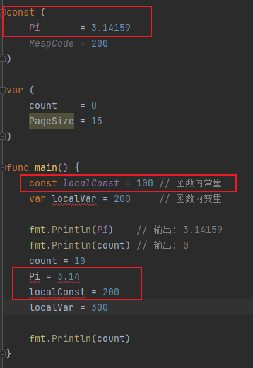

## 10，Go语言字符类型（byte和rune）

Go语言的字符有以下两种：

1，一种是 uint8 类型，或者叫 byte 型，代表了 ASCII 码的一个字符。

2，另一种是 rune 类型，代表一个 UTF-8 字符，`当需要处理中文、日文或者其他复合字符时，则需要用到 rune 类型。rune 类型等价于 int32 类型。`

`byte 类型是 uint8 的别名`，对于只占用 1 个字节的传统 ASCII 编码的字符来说，完全没有问题，例如 var ch byte = 'A'，字符使用单引号括起来。

```go
var ch int = '\u0041'
var ch2 int = '\u03B2'
var ch3 int = '\U00101234'
fmt.Printf("%d - %d - %d\n", ch, ch2, ch3) // integer
fmt.Printf("%c - %c - %c\n", ch, ch2, ch3) // character
fmt.Printf("%X - %X - %X\n", ch, ch2, ch3) // %X，用16进制数计算
fmt.Printf("%U - %U - %U", ch, ch2, ch3)   // %U用于输出 U + hhhh格式的字符串


## 结果如下
65 - 946 - 1053236
A - β - r
41 - 3B2 - 101234
U+0041 - U+03B2 - U+101234


判断是否为字母：unicode.IsLetter(ch)
判断是否为数字：unicode.IsDigit(ch)
判断是否为空白符号：unicode.IsSpace(ch)
```

## 11，类型转换

​		Go语言不存在隐式类型转换，因此所有的类型转换都必须显式的声明。

```go
// 语法
valueOfTypeB = typeB(valueOfTypeA)
类型 B 的值 = 类型 B(类型 A 的值)

a := 1.0
b := int(a)
```

​		只有相同底层类型的变量之间可以进行相互转换（如将 int16 类型转换成 int32 类型），不同底层类型的变量相互转换时会引发编译错误（如将 bool 类型转换为 int 类型）

## 12，Go指针

每个变量在运行时都拥有一个地址，这个地址代表变量在内存中的位置。Go语言中使用在变量名前面添加 & 操作符（前缀）来获取变量的内存地址（取地址操作），格式如下：

```go
ptr := &v	// v 的类型为 T
```

其中 v 代表被取地址的变量，变量 v 的地址使用变量 ptr 进行接收，ptr 的类型为 *T ，称做 T 的指针类型， * 代表指针。

```go
func main() {
	var cat int = 1
	var str string = "banana"
	fmt.Printf("%p %p", &cat, &str) // 0xc00000a0b8 0xc000024070
}
```

Demo

```go
package main

import (
    "fmt"
)

func main() {

    // 准备一个字符串类型
    var house = "Malibu Point 10880, 90265"

    // 对字符串取地址, ptr类型为*string
    ptr := &house

    // 打印ptr的类型
    fmt.Printf("ptr type: %T\n", ptr)	// ptr type: *string

    // 打印ptr的指针地址
    fmt.Printf("address: %p\n", ptr)	// address: 0xc0420401b0

    // 对指针进行取值操作
    value := *ptr

    // 取值后的类型
    fmt.Printf("value type: %T\n", value)	// value type: string

    // 指针取值后就是指向变量的值
    fmt.Printf("value: %s\n", value)	// Malibu Point 10880, 90265

}
```

使用指针修改值

```go
...
...
// 交换函数
func swap(a, b *int) {

	// 取a指针的值, 赋给临时变量t
	t := *a
	fmt.Println(*a) // 1

	// 取b指针的值, 赋给a指针指向的变量
	*a = *b
	fmt.Println(*b) // 2

	// 将a指针的值赋给b指针指向的变量
	*b = t
}

func main() {

	// 准备两个变量, 赋值1和2
	x, y := 1, 2

	// 交换变量值
	swap(&x, &y)

	// 输出变量值
	fmt.Println(x, y)
}
```

如果上面的swap函数直接交换指针，则变量 x 和 y的值不会交换成功

```go
func swap(a, b *int) {
	fmt.Println(a, b) // 0xc00000a0b8 0xc00000a0d0
	b, a = a, b
	fmt.Println(a, b)   // 0xc00000a0d0 0xc00000a0b8
	fmt.Println(*a, *b) // 2 1
}

func main() {
	x, y := 1, 2
	swap(&x, &y)
	fmt.Println(x, y) // 1 2
}
```

这种标准写法也无法实现

```go
var t int

func swap(a, b int) {
	t = a
	a = b
	b = t
}

func main() {
	x, y := 1, 2
	swap(x, y)
	fmt.Println(x, y) // 1 2
}
```

示例：使用指针变量获取命令行的输入信息

```go
package main

// 导入系统包
import (
    "flag"
    "fmt"
)

// 定义命令行参数
var mode = flag.String("mode", "", "process mode")

func main() {

    // 解析命令行参数
    flag.Parse()

    // 输出命令行参数
    fmt.Println(*mode)
}
```

用new()创建指针。

```go
...
func main() {
	str := new(string)
	*str = "Go语言教程"

	fmt.Println(*str)	// Go语言教程
}
```

## 13，Go语言常量

​	Go语言中的常量使用关键字 const 定义，用于存储不会改变的数据，常量是在编译时被创建的，即使定义在函数内部也是如此，并且只能是布尔型、数字型（整数型、浮点型和复数）和字符串型。

```go
// 语法格式
const name [type] = value
```

数据类型也有对应常量，例如 `int64` 的常量表达为 `time.Minute`

批量声明的常量，除了第一个外其它的常量右边的初始化表达式都可以省略，如果省略初始化表达式则表示使用前面常量的初始化表达式，对应的常量类型也是一样的。例如：

```go
const (
    a = 1
    b
    c = 2
    d
)

fmt.Println(a, b, c, d) // "1 1 2 2"
```

**iota 常量生成器**

​	常量声明可以使用 iota 常量生成器初始化，它用于生成一组以相似规则初始化的常量，但是不用每行都写一遍初始化表达式。在一个 const 声明语句中，在第一个声明的常量所在的行，iota 将会被置为 0，然后在每一个有常量声明的行加一。

```go
type Weekday int

const (
    Sunday Weekday = iota
    Monday
    Tuesday
    Wednesday
    Thursday
    Friday
    Saturday
)
```

## 14，Go语言枚举

枚举本质就是一系列常量。所以，go语言中可以使用const来定义枚举，如：

```go
const (
   Male = "男性"
   Female = "女性"
)


// 为枚举常量定义类型别名
type Gender = string

const (
   Male Gender = "男性"
   Female Gender = "女性"
)
```

## 15，类型别名

在Go 1.9 版本之前，定义内建类型的代码是这样写的：

```go
type byte uint8
type rune int32
```

在 1.9 版本后变为：

```go
type byte = uint8
type rune = int32
```

**区分类型别名与类型定义**

```go
// 定义类型别名的写法为：
type TypeAlias = Type


# 对比
// 创建int类型的NewInt类型（产生新的类型）
type NewInt int
// 将int取一个别名叫IntAlias（只是起了个别名，打印出来类型依旧是int）
type IntAlias = int
```

demo

```go
type NewInt int
type IntAlias = int

func main() {
	var a NewInt
	// 查看a的类型名
	fmt.Printf("a type：%T\n", a) // a type：main.NewInt

	// 将 a2 声明为IntAlias类型
	var a2 IntAlias
	// 查看a2的类型名
	fmt.Printf("a2 type：%T\n", a2) // a2 type：int
}

// 个人记法：直接赋值类型相同，直接定义则出现新的类型
```

**非本地类型不能定义方法**，例如下面这段代码：

```go
package main

import (
    "time"
)

// 定义time.Duration的别名为MyDuration
type MyDuration = time.Duration

// 为MyDuration添加一个函数
func (m MyDuration) EasySet(a string) {}

func main() {}
```

编译上面代码报错，信息如下：cannot define new methods on non-local type time.Duration

编译器提示：不能在一个非本地的类型 time.Duration 上定义新方法，非本地类型指的就是 time.Duration 不是在 main 包中定义的，而是在 time 包中定义的，与 main 包不在同一个包中，因此不能为不在一个包中的类型定义方法。

解决这个问题有下面两种方法：

1）将第 8 行修改为 type MyDuration time.Duration，也就是将 MyDuration 从别名改为类型；
2）将 MyDuration 的别名定义放在 time 包中。

## 16，Go语言关键字与标识符

> **关键字**

​		Go语言的词法元素包括 5 种，分别是标识符（identifier）、关键字（keyword）、操作符（operator）、分隔符（delimiter）、字面量（literal），它们是组成Go语言代码和程序的最基本单位。

​		关键字即是被Go语言赋予了特殊含义的单词，也可以称为保留字。Go语言中的关键字一共有 25 个：

```bash
break	default 	func	interface	select
case	defer	go	  map	  struct
chan	else	goto	package	  switch
const	fallthrough	  if	range	type
continue	for	  import	return	  var
```

> **标识符**

​		标识符是指Go语言对各种变量、方法、函数等命名时使用的字符序列，标识符由若干个字母、下划线 _ 、和数字组成，且第一个字符必须是字母。

标识符命名需要遵循以下规则：

```bash
由 26 个英文字母、0~9、_组成；
不能以数字开头，例如 var 1num int 是错误的；
Go语言中严格区分大小写；
标识符不能包含空格；
不能以系统保留关键字作为标识符，比如 break，if 等等。
命名标识符时还需要注意以下几点：

标识符的命名要尽量采取简短且有意义；
不能和标准库中的包名重复；
为变量、函数、常量命名时采用驼峰命名法，例如 stuName、getVal；
```

## 17，Go语言运算符的优先级

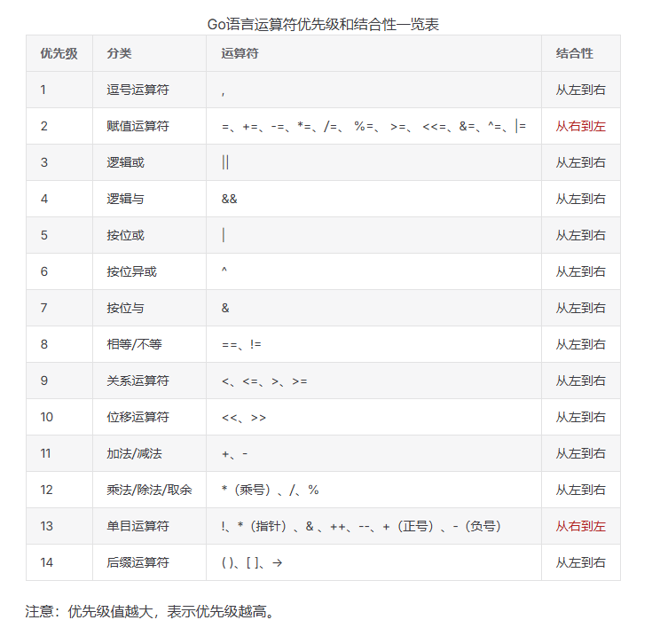

一个简单的例子：

```go
a + b * c 在数学运算中先算 b * c 然后再将结果 + a，在go语言中也是如此；
```

## 18，Go语言字符串和数值类型的相互转换

使用 `strconv` 包

int型 -> string型（**Itoa**函数）

```go
import (
	"fmt"
	"strconv"
)

func main() {
	num := 69
	str := strconv.Itoa(num)
	fmt.Println(str)                 // 69
	fmt.Printf("str Type：%T\n", str) // str Type：string
}
```

string -> int （Atoi()函数）

```go
import (
	"fmt"
	"strconv"
)

func main() {
	str1 := "69"
	str2 := "i69"
	num1, err := strconv.Atoi(str1)
	if err != nil {
		fmt.Println("转换失败！", str1)
	} else {
		fmt.Printf("转换成功！value:%d type:%T\n", num1, num1)
	}

	num2, err := strconv.Atoi(str2)
	if err != nil {
		fmt.Println("转换失败！", str2)
	} else {
		fmt.Printf("转换成功！value:%d type:%T\n", num2, num2)
	}
}

/**
转换成功！value:69 type:int
转换失败！ i69
 */
```

接下来还有一些其他的我们这里简述：

1）ParseBool()，用于 string -> bool

```go
// 函数体
ParseBool(s string)

1、0、t、f、T、F、true、false、True、False、TRUE、FALSE
仅限字符串为以上内容时可以转换，其他均会报错
```

2）ParseInt()，string -> int

ParseInt() 函数用于返回字符串表示的整数值（可以包含正负号）

```go
// 函数体
func ParseInt(s string, base int, bitSize int) (i int64, err error)
/**
 s 指定要转化的字符串
 base 指定进制，如2,8,10,16
 bitSize 指定结果必须能无溢出赋值的整数类型，0、8、16、32、64 分别代表 int、int8、int16、int32、int64
*/
```

还有一些其他的我们这里不再赘述，参考文章：https://blog.csdn.net/qq_42642142/article/details/120234372

# 二、Go语言集合篇

## 1，数组

声明语法：var 数组变量名[元素数量] 数组类型

```go
// 示例
var arr [5]int

fmt.Println(a[0])        // 打印第一个元素
fmt.Println(a[len(a)-1]) // 打印最后一个元素
```

打印索引和元素

```go
var arr [5]int

func demo01() {

	for i := 0; i < 5; i++ {
		arr[i] = i + 1
	}
	for i, v := range arr {
		fmt.Printf("%d %d\n", i, v)
		/**
			0 1
			1 2
			2 3
			3 4
			4 5
		 */
	}
}

// 仅打印元素
for _, v := range arr {
    fmt.Printf("%d\n", v)
}s
```

默认情况下，数组的每个元素都会被初始化为元素类型对应的零值，对于数字类型来说就是 0，同时也可以使用数组字面值语法，用一组值来初始化数组：

```go
var q [3]int = [3]int{1, 2, 3}
var r [3]int = [3]int{1, 2}
fmt.Printf("%d %d\n", q[1], r[2]) // 2 0
```

数组的长度是数组类型的一个组成部分，因此 [3]int 和 [4]int 是两种不同的数组类型，数组的长度必须是常量表达式，因为数组的长度需要在编译阶段确定。

```go
q := [3]int{1, 2, 3}
q = [4]int{1, 2, 3, 4} // 编译错误：无法将 [4]int 赋给 [3]int
```

**比较两个数组是否相等**

​	如果两个数组类型相同（包括数组的长度，数组中元素的类型）的情况下，我们可以直接通过较运算符（ == 和 != ）来判断两个数组是否相等，只有当两个数组的所有元素都是相等的时候数组才是相等的，不能比较两个类型不同的数组，否则程序将无法完成编译。

```go
a := [2]int{1, 2}
b := [...]int{1, 2}
c := [2]int{1, 3}
fmt.Println(a == b, a == c, b == c) // "true false false"
d := [3]int{1, 2}
fmt.Println(a == d) // 编译错误：invalid operation: a == d (mismatched types [2]int and [3]int)
```

## 2，多维数组

定义语法：var array_name [size1]\[size2]...[sizen]array_type

例如：

```go
var tables [3][4]int

// 同小节1一致，这里两种方式声明数组

// 声明一个二维整型数组，两个维度的长度分别是 4 和 2
var array [4][2]int
// 使用数组字面量来声明并初始化一个二维整型数组
array = [4][2]int{{10, 11}, {20, 21}, {30, 31}, {40, 41}}
// 声明并初始化数组中索引为 1 和 3 的元素
array = [4][2]int{1: {20, 21}, 3: {40, 41}}
// 声明并初始化数组中指定的元素
array = [4][2]int{1: {0: 20}, 3: {1: 41}}
```

## 3，Go语言切片

> 语法：(数组实例,[begin,end])

​		切片（slice）是对数组的一个连续片段的引用，所以切片是一个引用类型（因此更类似于 C/ C++ 中的数组类型，或者 Python 中的 list 类型），这个片段可以是整个数组，也可以是由起始和终止索引标识的一些项的子集，需要注意的是，终止索引标识的项不包括在切片内。

​		Go语言中切片的内部结构包含地址、大小和容量，切片一般用于快速地操作一块数据集合，如果将数据集合比作切糕的话，切片就是你要的“那一块”，切的过程包含从哪里开始（切片的起始位置）及切多大（切片的大小），容量可以理解为装切片的口袋大小，如下图所示。

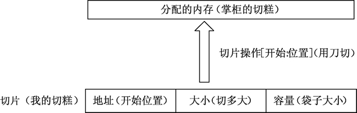

**从数组或切片生成新的切片**

​		切片默认指向一段连续内存区域，可以是数组，也可以是切片本身，从连续内存区域生成切片是常见的操作，格式如下：**slice [开始位置 : 结束位置]**

```bash
# 语法说明如下
slice：表示目标切片对象；
开始位置：对应目标切片对象的索引；
结束位置：对应目标切片的结束索引；
```

从数组生成切片，代码如下：

```go
func demo02() {
	var a = [3]int{1, 2, 3}
	fmt.Println(a, a[1:2]) // [1 2 3] [2]
}

// 代码解释
a -> [1,2,3] 打印整个数组，输出所有元素
a[1:2]，数组的切片操作，[1:2]表示从索引1开始，到索引2结束（不包含索引2），索引1对应元素2


// 例如下面我们把切片索引更改，则得到的结果为2,3
func demo02() {
	var a = [3]int{1, 2, 3}
	fmt.Println(a, a[1:3]) // [1 2 3] [2 3]
}
// 这里数组a的长度为3，那么索引应该分别为 0,1,2 啊，为什么写到3还能正常执行并且输出预期结果呢？
解释：数组切片 [low:high] 中允许 high 等于数组和长度，顺便在这里说明一下 low 与 high 的取值范围，
low的有效范围：0 <= low <= len(arr)
high的有效范围：low <= high <= len(arr)
所以也导致当high值取到 len(a) + 1 ，即 4 或者更大时程序会报错
```

1）从指定位置生成切片：切片和数组密不可分，如果将数组理解为一栋办公楼，那么切片就是把不同的连续六层出租给使用者，出租的过程需要选择开始楼层和结束楼层，这个过程就会生成切片，示例代码如下：

```go
// 2，从指定位置生成切片
var highRiseBuilding [30]int

for i := 0; i < 30; i++ {
    highRiseBuilding[i] = i + 1	// 数组highRiseBuilding[]的内容为数字1~30
}
// 区间
fmt.Println(highRiseBuilding[10:15]) // [11 12 13 14 15]

// 中间到尾部的所有元素
fmt.Println(highRiseBuilding[20:]) // [21 22 23 24 25 26 27 28 29 30]

// 开头到中间指定位置的所有元素
fmt.Println(highRiseBuilding[:2]) // [1 2]
```

这里提一嘴，切片的索引其实位置计算规则与数组确认是哪一个元素的规律一样。

2）表示所有切片。

```go
// 表示所有切片
arr := []int{1, 2, 3}
fmt.Println(arr[:]) // [1 2 3]
```

3）重置切片，清空拥有的元素。

把切片的开始和结束位置都设为0时，生成的切片将变空，代码如下：

```go
// 重置切片，清空拥有的元素
// 把切片的开始和结束位置都设为0时，生成的切片将变空
a := []int{1, 2, 3}
// 简单理解 a[0:0] 就是从索引 0 到 索引 0 ，但是又不能包含索引0，故而为空
fmt.Println(a[0:0]) // []
```

### 3.1 直接声明新的切片。

声明格式如下：**var name []Type**

​		除了可以从原有的数组或者切片中生成切片外，也可以声明一个新的切片，每一种类型都可以拥有其切片类型，表示多个相同类型元素的连续集合，因此切片类型也可以被声明。

其中 name 表示切片的变量名，Type 表示切片对应的元素类型。

```go
// < ==== 直接声明新的切片 ==== > //
	// 声明字符串切片
	var strList []string

	// 声明整形切片
	var numList []int

	// 声明一个空切片
	var numListEmpty = []int{}

	// 输出三个切片
	fmt.Println(strList, numList, numListEmpty) // [] [] []

	// 输出三个切片大小
	fmt.Println(len(strList), len(numList), len(numListEmpty)) // 0 0 0

	// 切片判定空的结果
	fmt.Println(strList == nil)      // true
	fmt.Println(numList == nil)      // true
	fmt.Println(numListEmpty == nil) // false
```

### 3.2 使用make构造切片

如果需要动态地创建一个切片，可以使用 make() 内建函数，格式如下：

> make([]Type,size,cap)

```bash
# 参数解释说明
Type: 指切片的元素类型
size: 指为这个类型分配多少个元素
cap: 预分配的元素数量，这个值设定后不影响 size,只是能提前分配空间，降低多次分配空间造成的性能问题。
```

示例代码如下：

```go
// < ==== 使用make()函数构造切片 ==== > //

a := make([]int, 2)
b := make([]int, 2, 10)

fmt.Println(a, b) // [0 0] [0 0]
fmt.Println(len(a), len(b)) // 2 2
```

### 3.3 使用append()为切片添加元素

Go语言的内建函数 append() 可以为切片动态添加元素，代码如下所示：

```go
var a []int
a = append(a, 1)
a = append(a, 1, 2, 3)
a = append(a, []int{1, 2, 3}...)
fmt.Println(a[0:]) // [1 1 2 3 1 2 3]
```

​		不过需要注意的是，在使用 append() 函数为切片动态添加元素时，如果空间不足以容纳足够多的元素，切片就会进行“扩容”，此时新切片的长度会发生改变。切片在扩容时，容量的扩展规律是按容量的 2 倍数进行扩	充，例如 1、2、4、8、16……

```go
var numbers []int
	for i := 0; i < 10; i++ {
		numbers = append(numbers, i)
		fmt.Printf("len: %d  cap: %d pointer: %p\n", len(numbers), cap(numbers), numbers)
		
		/**
		len: 1  cap: 1 pointer: 0xc00000a0b8
		len: 2  cap: 2 pointer: 0xc00000a100
		len: 3  cap: 4 pointer: 0xc0000141a0
		len: 4  cap: 4 pointer: 0xc0000141a0
		len: 5  cap: 8 pointer: 0xc000012300
		len: 6  cap: 8 pointer: 0xc000012300
		len: 7  cap: 8 pointer: 0xc000012300
		len: 8  cap: 8 pointer: 0xc000012300
		len: 9  cap: 16 pointer: 0xc00007a000
		len: 10  cap: 16 pointer: 0xc00007a000
		 */
	}

cap()函数用于求numbers这个切片的容量，“容量”指的是切片底层数组从切片第一个元素算起，到底层数组末尾所能容纳的元素总数。
```

## 4，切片复制

> copy()

Go语言的内置函数 copy() 可以将一个数组切片复制到另一个数组切片中，如果加入的两个数组切片不一样大，就会按照其中较小的那个数组切片的元素个数进行复制。

函数的使用格式如下：**copy( destSlice, srcSlice []T) int**

```go
slice1 := []int{1, 2, 3, 4, 5}
slice2 := []int{5, 4, 3}
/*copy(slice2, slice1) // 只会复制slice1的前3个元素到slice2中
	fmt.Println(slice1)  // [1 2 3 4 5]
	fmt.Println(slice2)  // [1 2 3]*/
copy(slice1, slice2) // 只会复制slice2的3个元素到slice1的前3个位置
fmt.Println(slice1)  // [5 4 3 4 5]
fmt.Println(slice2)  // [1 2 3]
```

## 5，从切片中删除元素

> **从开头位置删除**

需要使用切片本身的特性来删除元素，根据要删除元素的位置有三种情况，分别是从开头位置删除、从中间位置删除和从尾部删除，其中删除切片尾部的元素速度最快。

```go
var a = []int{1, 2, 3}
a = a[1:]      // 删除第一个元素
a = a[N:]      // 删除开头 N 个元素
fmt.Println(a) // [2 3]
```

也可以不移动数据指针，但是将后面的数据向开头移动，可以用 append 原地完成（所谓原地完成是指在原有的切片数据对应的内存区间内完成，不会导致内存空间结构的变化）：

```go
a = []int{1, 2, 3}
a = append(a[:0], a[1:]...) // 删除开头1个元素
a = append(a[:0], a[N:]...) // 删除开头N个元素
```

还可以用 copy() 函数来删除开头的元素：

```go
a = []int{1, 2, 3}
a = a[:copy(a, a[1:])] // 删除开头1个元素
a = a[:copy(a, a[N:])] // 删除开头N个元素
```

> **从中间位置删除**

对于删除中间的元素，需要对剩余的元素进行一次整体挪动，同样可以用 append 或 copy 原地完成：

```go
a = []int{1, 2, 3, ...}
a = append(a[:i], a[i+1:]...) // 删除中间1个元素
a = append(a[:i], a[i+N:]...) // 删除中间N个元素
a = a[:i+copy(a[i:], a[i+1:])] // 删除中间1个元素
a = a[:i+copy(a[i:], a[i+N:])] // 删除中间N个元素
```

> **从尾部删除**

```go
a = []int{1, 2, 3}
a = a[:len(a)-1] // 删除尾部1个元素
a = a[:len(a)-N] // 删除尾部N个元素
```

删除开头的元素和删除尾部的元素都可以认为是删除中间元素操作的特殊情况，下面来看一个示例。

```go
package main

import "fmt"

func main() {
    // 删除开头的元素和删除尾部的元素都可以认为是删除中间元素操作的特殊情况，下面来看一个示例。
	seq := []string{"a", "b", "c", "d", "e"}
	// 设置要删除的元素索引
	index := 2

	fmt.Println(seq[:index], seq[index+1:]) // [a b] [d e]

	// 将删除点前后的元素连接起来
	seq = append(seq[:index], seq[index+1:]...) // [a b d e]
	fmt.Println(seq)
}
```

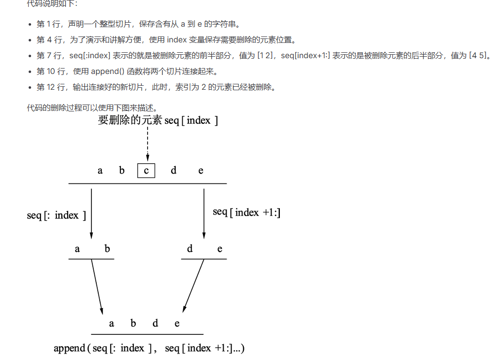

## 6，Go语言range关键字

range关键字可以配合Go语言中的for关键字来迭代切片中的每一个元素

```go
// 示例代码
// 01、利用range + for迭代切片中的元素
slice := []int{10, 20, 30, 40}
// 迭代每一个元素，并显示其值
for index, value := range slice {
    fmt.Printf("Index: %d, Value: %d\n", index, value)
}
```

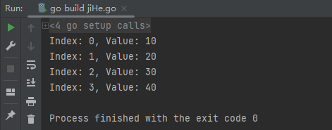

当迭代切片时，关键字 range 会返回两个值，第一个值是当前迭代到的索引位置，第二个值是该位置对应元素值的一份副本。**需要强调的是，range 返回的是每个元素的副本，而不是直接返回对该元素的引用**，，如下代码所示：

```go
// 创建一个整型切片，并赋值
slice := []int{10, 20, 30, 40}
// 迭代每个元素，并显示值和地址
for index, value := range slice {
    fmt.Printf("Value: %d Value-Addr: %X ElemAddr: %X\n", value, &value, &slice[index])
}
```

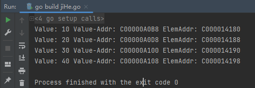

## 7，Go语言多维切片

```go
//声明一个二维切片
var slice [][]int
//为二维切片赋值
slice = [][]int{{10}, {100, 200}}


// 可简写为
slice := [][]int{{10}, {100, 200}}
```

上面的代码中展示了一个包含两个元素的外层切片，同时每个元素包又含一个内层的整型切片，切片 slice 的值如下图所示。

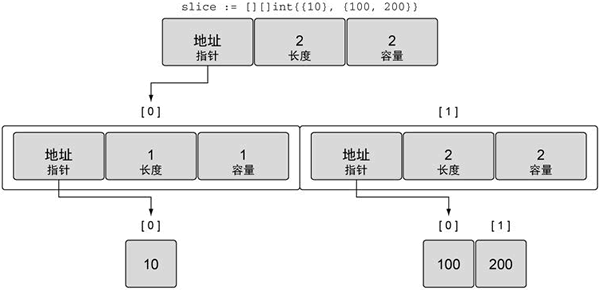

通过上图可以看到外层的切片包括两个元素，每个元素都是一个切片，第一个元素中的切片使用单个整数 10 来初始化，第二个元素中的切片包括两个整数，即 100 和 200。

> 组合切片的切片
>

```go
//声明一个二维切片
var slice [][]int
//为二维切片赋值
slice = [][]int{{10}, {100, 200}}
fmt.Println(slice)
fmt.Println("========================")
fmt.Printf("%#v\n", slice)
fmt.Println("========================")
for i, row := range slice {
    fmt.Printf("第 %d 行: %v\n", i, row)
}

/**
	[[10] [100 200]]
	========================
	[][]int{[]int{10}, []int{100, 200}}
	========================
	第 0 行: [10]
	第 1 行: [100 200]
	*/
/**
	上边代码可简写为：
	// 声明一个二维整型切片并赋值
	slice := [][]int{{10}, {100, 200}}
	*/

fmt.Println("====== 追加后 ======")
// 为第一个切片追加值为 20 的元素
slice[0] = append(slice[0], 20)

for i, row := range slice {
    fmt.Printf("第 %d 行: %v\n", i, row)
}

/**
	====== 追加后 ======
	第 0 行: [10 20]
	第 1 行: [100 200]
	 */
```

## 8，Map映射

声明一个map数据

```go
var MAPNAME map[KEYTYPE]VALUETYPE

// MAPNAME: map变量名
// KEYTYPE: 键类型
// VALUETYPE: 值类型
```

```go
var mapLit map[string]int
var mapAssigned map[string]int
mapLit = map[string]int{"one": 1, "two": 2}
// 代码中的 mapCreated 的创建方式 mapCreated := make(map[string]float) 等价于 mapCreated := map[string]float{}
mapCreated := make(map[string]float32)
//mapAssigned 是 mapList 的引用，对 mapAssigned 的修改也会影响到 mapLit 的值。
mapAssigned = mapLit
mapCreated["key1"] = 4.5
mapCreated["key2"] = 3.14159
mapAssigned["two"] = 3
fmt.Printf("Map literal at \"one\" is: %d\n", mapLit["one"])       // 1
fmt.Printf("Map created at \"key2\" is: %f\n", mapCreated["key2"]) // 3.14159
fmt.Printf("Map assigned at \"two\" is: %d\n", mapLit["two"])      // 3
fmt.Printf("Map literal at \"ten\" is: %d\n", mapLit["ten"])       // 0
```

> **map容量**

和数组不同，map 可以根据新增的 key-value 动态的伸缩，因此它不存在固定长度或者最大限制，但是也可以选择标明 map 的初始容量 capacity，格式如下：

```go
make(map[KEYTYPE]VALUETYPE,cap)

// 例如：
map2 := make(map[string]float,100)
```

所以出于性能的考虑，对于大的 map 或者会快速扩张的 map，即使只是大概知道容量，也最好先标明。

用切片作为map的值：

```go
// 如果一个 key 要对应多个值怎么办？例如，当我们要处理 unix 机器上的所有进程，以父进程（pid 为整形）作为 key，所有的子进程（以所有子进程的 pid 组成的切片）作为 value。通过将 value 定义为 []int 类型或者其他类型的切片，就可以优雅的解决这个问题，示例代码如下所示：

mp1 := make(map[int][]int)
// 添加子进程
mp1[100] = append(mp1[100], 2001)
mp1[100] = append(mp1[100], 2002)
mp1[100] = append(mp1[100], 2003)

// 读取所有子进程
//childProcesses := mp1[100] // [2001, 2002, 2003]

// 遍历
for pid, children := range mp1 {
    fmt.Printf("父进程 %d 的子进程: %v\n", pid, children)
    // 父进程 100 的子进程: [2001 2002 2003]
}


// 方案2: 值类型为切片指针
map2 := make(map[int]*[]int)

children := []int{2001, 2002}
map2[100] = &children

// 添加子进程
(*map2[100]) = append(*map2[100], 2003)

// 或者
childrenPtr := map2[100]
*childrenPtr = append(*childrenPtr, 2004)

// 读取
fmt.Println(*map2[100]) // [2001 2002 2003 2004]
```

## 9，遍历map

1,适应for range循环

```go
scene := make(map[string]int)
scene["route"] = 66
scene["brazil"] = 4
scene["china"] = 960

for k, v := range scene {
    fmt.Println(k, v)

    /**
		china 960
		route 66
		brazil 4
		 */
}

// 只打印value
for _,v := range scece {}

// 只打印key
for k := range scece {}
```

如果需要特定顺序的遍历结果，正确的做法是先排序，代码如下：

```go
scene := make(map[string]int)
scene["route"] = 66
scene["brazil"] = 4
scene["china"] = 960

// 声明一个切片保存Map数据
var sceceList []string

// 将Map数据遍历到切片中
for k := range scene {
    sceceList = append(sceceList, k)
}

// 对切片进行排序
// sort()按照字母升序进行排序
sort.Strings(sceceList)

// 输出
fmt.Println(sceceList) // [brazil china route]
```

## 10，map的删除与清空

使用内置函数 **delete()**

```go
scene := make(map[string]int)

// 准备map数据
scene["route"] = 66
scene["brazil"] = 4
scene["china"] = 960

delete(scene, "brazil")

for k, v := range scene {
    fmt.Println(k, v)
}

// 输出结果如下：
route 66
china 960
```

清空 map 的唯一办法就是重新 make 一个新的 map

```go
// 原始 map
scene := make(map[string]int)
scene["route"] = 66
scene["brazil"] = 4
scene["china"] = 960

fmt.Println("清空前:", scene)  // map[brazil:4 china:960 route:66]

// 清空 map：直接重新 make
scene = make(map[string]int)

fmt.Println("清空后:", scene)  // map[]
```

## 11，并发安全的sync.map

Go语言在 1.9 版本中提供了一种效率较高的并发安全的 sync.Map，sync.Map 和 map 不同，不是以语言原生形态提供，而是在 sync 包下的特殊结构。

**sync.Map有如下特性：**

1、无需初始化，直接声明即可；

2、sync.Map 不能使用 map 的方式进行取值和设置等操作，而是使用 sync.Map 的方法进行调用，Store 表示存储，Load 表示获取，Delete 表示删除；

3、使用 Range 配合一个回调函数进行遍历操作，通过回调函数返回内部遍历出来的值，Range 参数中回调函数的返回值在需要继续迭代遍历时，返回 true，终止迭代遍历时，返回 false。

```go
import {
    "fmt"
    "sync"
}

func demo06() {
	var scene sync.Map

	// 将键值对保存到sync.Map
	scene.Store("greece", 97)
	scene.Store("london", 100)
	scene.Store("egypt", 200)

	// 从sync.Map中根据键取值
	fmt.Println(scene.Load("london")) // 100 true

	// 根据键删除对应的键值对
	scene.Delete("london")

	// 遍历多有sync.Map中的键值对
	scene.Range(func(key, value interface{}) bool {
		fmt.Println("iterate: ", key, value)
		/**
		iterate:  greece 97
		iterate:  egypt 200
		*/
		return true
	})
}
```

## 12，List列表

**1）初始化列表**

```go
// 1，通过 container/list 包的 New() 函数初始化
list 变量名 := list.new()

// 2，通过var关键字声明初始化
list var 变量名 list.List
```

列表并没有具体元素类型的限制，因此，列表的元素可以是任意类型。

**2）向列表中插入元素**

双链表支持从队列前方或后方插入元素，分别对应的方法是 PushFront 和 PushBack。

这两个方法都会返回一个 *list.Element 结构，如果在以后的使用中需要删除插入的元素，则只能通过 *list.Element 配合 Remove() 方法进行删除，这种方法可以让删除更加效率化，同时也是双链表特性之一。

```go
l := list.New()

// 将 fist 字符串插入到列表的尾部，此时列表是空的，插入后只有一个元素。
l.PushBack("fist")

// 将数值 67 放入列表，此时，列表中已经存在 fist 元素，67 这个元素将被放在 fist 的前面。
l.PushFront(67)
```

列表插入元素的方法如下表所示。

| 方法                                                  | 功能                                              |
| ----------------------------------------------------- | ------------------------------------------------- |
| InsertAfter(v interface {}, mark * Element) * Element | 在 mark 点之后插入元素，mark 点由其他插入函数提供 |
| InsertBefore(v interface {}, mark * Element) *Element | 在 mark 点之前插入元素，mark 点由其他插入函数提供 |
| PushBackList(other *List)                             | 添加 other 列表元素到尾部                         |
| PushFrontList(other *List)                            | 添加 other 列表元素到头部                         |

**3）从列表中删除元素**

```go
func demo07() {
	// 列表插入函数的返回值会提供一个 *list.Element结构，这个结构记录着列表元素的值以及与其他节点之间的关系等信息，从列表中删除元素时，需要用到这个结构进行快速删除

	/**
	列表操作元素
	*/
    
    // 创建列表实例
	l := list.New()
	// 尾部添加
	l.PushBack("canon")
	// 头部添加
	l.PushFront(67)

	// 尾部添加后保存元素句柄
	element := l.PushBack("fist")

	// 在fist后添加high
	l.InsertAfter("high", element)

	// 在 fist 之前添加 noon
	l.InsertBefore("noon", element)

	// 使用
	l.Remove(element)
}
```

列表操作过程：

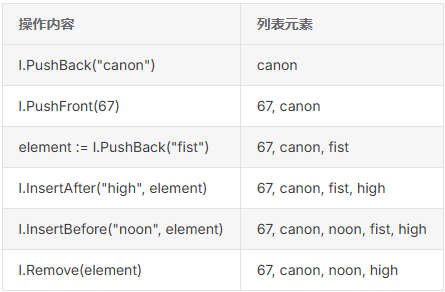

**4）遍历列表**

遍历双链表需要配合 `Front()` 函数获取头元素，遍历时只要元素不为空就可以继续进行，每一次遍历都会调用元素的 `Next()` 函数

```go
for i := l.Front(); i != nil; i = i.Next() {
    fmt.Println(i.Value)
}

// 结果如下
67
canon
noon
high
```

## 13，Go语言nil值零值

​		布尔类型的零值（初始值）为 false，数值类型的零值为 0，字符串类型的零值为空字符串 "" ，而指针、切片、映射、通道、函数和接口的零值则是 nil。

​		Go语言中的 nil 和其他语言中的 null 有很多不同点。

```go
// nil 值不能进行比较
fmt.Println(nil==nil)

# command-line-arguments
.\jiHe.go:367:21: invalid operation: nil == nil (operator == not defined on untyped nil)

// 从上面的运行结果不难看出， == 对于 nil 来说是一种未定义的操作。
```

不同类型 nil 的指针是一样的。

```go
package main

import (
    "fmt"
)

func main() {
    var arr []int
    var num *int
    fmt.Printf("%p\n", arr)
    fmt.Printf("%p", num)
}
```

不同类型的 nil 是不能比较的；

两个相同类型的 nil 值也可能无法比较；

nil 是 map、slice、pointer、channel、func、interface 的零值；

不同类型的 nil 值占用的内存大小可能是不一样的。

## 14，make与new的区别与实现原理

**1）核心区别：**

new：只分配内存，不进行初始化。它返回一个指向该类型零值的指针 (*Type)。

make：只能用于 slice、map、channel 三种引用类型的初始化。它返回的是类型本身 (Type)，而不是指针。

**2）详细说明：**

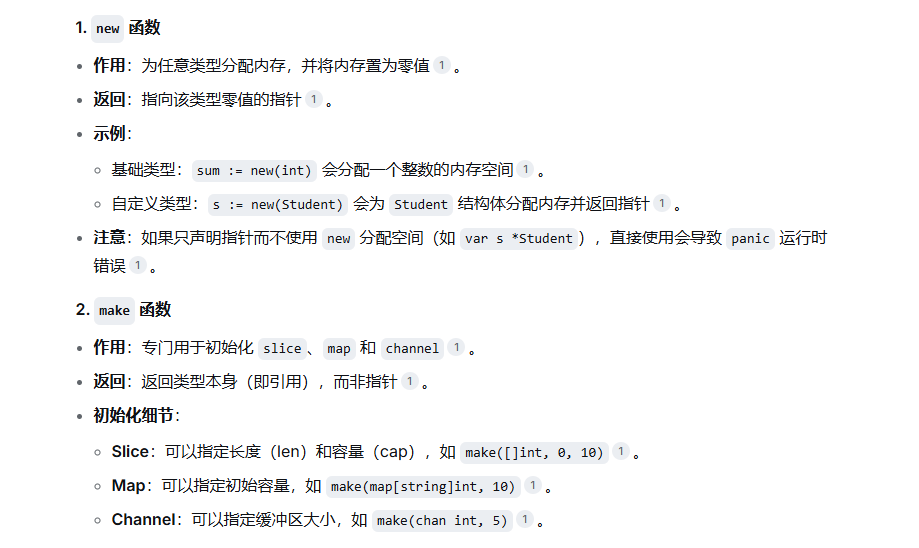

**3）实现原理简述：**

​		make 的编译过程：在编译的类型检查阶段，make 关键字会根据参数类型（slice、map、chan）分别转换成 OMAKESLICE、OMAKEMAP 和 OMAKECHAN 三种不同的节点，最终调用对应的运行时函数来完成初始化。

​		new 的编译过程：在编译的代码生成阶段，new 关键字会调用 newobject 函数。newobject 函数会根据类型大小，调用 mallocgc 在堆上申请内存并返回指针。不过，如果变量只在当前函数内使用，编译器可能会将其分配在栈上以提升性能。

**4）总结**

​		简单来说，new 负责给任何类型分配内存并返回指针，而 make 只负责初始化 slice、map 和 channel 这三种引用类型并返回类型本身。

# 三、Golang流程控制

## 1，if语句

```go
if condition {
    // do something
}
```

如果存在第二个分支

```go
if condition {
    // do something
} else {
    // do something
}
```

如果存在第三个分支

```go
if condition1 {
    // do something
} else if condition2 {
    // do something else
}else {
    // catch-all or default
}
```

if 还有一种特殊的写法，可以在 if 表达式之前添加一个执行语句，再根据变量值进行判断，代码如下：

```go
if err := Connect(); err != nil {
    fmt.Println(err)
    return
}
```

## 2，循环结构

```go
sum := 0
for i := 0; i < 10; i++ {
    sum += i
}
```

简化的书写机制

```go
sum := 0
for {
    sum++
    if sum > 100 {
        break
    }
}
```

初始语句可以被忽略，但是初始语句之后的分号必须要写，代码如下：

```go
step := 2
for ; step > 0; step-- {
    fmt.Println(step)
}
```

## 3，乘法表案例

```go
package main

import "fmt"

func main() {

    // 遍历, 决定处理第几行
    for y := 1; y <= 9; y++ {

        // 遍历, 决定这一行有多少列
        for x := 1; x <= y; x++ {
            fmt.Printf("%d*%d=%d ", x, y, x*y)
        }

        // 手动生成回车
        fmt.Println()
    }
}
```

## 4，Go语言键值循环

**for range**`结构是Go语言特有的一种的迭代结构，在许多情况下都非常有用，for range 可以遍历`数组`、`切片`、`字符串`、`map 及通道（channel）`，for range 语法上类似于其它语言中的 foreach 语句

```go
// 一般格式如下
for index, value := range entity { ... }
```

**value** 始终为集合中对应索引的**值拷贝**，因此它一般只具有只读性质，对它所做的任何修改都不会影响到集合中原有的值。

用 for 循环迭代字符串

```go
// 迭代字符串
str := "Hello An!"

for i, v := range str {
    fmt.Printf("索引 %d为字符 %c\n", i, v)
}


索引 0为字符 H
索引 1为字符 e
索引 2为字符 l
索引 3为字符 l
索引 4为字符 o
索引 5为字符  
索引 6为字符 A
索引 7为字符 n
索引 8为字符 !
```

for 循环遍历切片

```go 
// 遍历切片
pceie := []int{1, 2, 3, 4, 5}
for i1, v1 := range pceie {
    fmt.Printf("切片第%d个为%d\n", i1, v1)
}


切片第0个为1
切片第1个为2
切片第2个为3
切片第3个为4
切片第4个为5
```

for 循环迭代数组

```go
// 遍历数组
//m := map[string]int{}
m := make(map[string]int)

m["hello"] = 100
m["world"] = 200

// 数组直接赋值
m := map[string]int{
    "hello": 100,
    "world": 200,
}

for mindex, mvalue := range m {
    fmt.Printf("索引%s值为%d\n", mindex, mvalue)
}

索引hello值为100
索引world值为200
```

for 循环遍历通道（channel）

```go
// 遍历通道（channel）
c := make(chan int)

go func() {
    c <- 1
    c <- 2
    c <- 3
    close(c)
}()

for v := range c {
    fmt.Println(v)
}

// 结果如下：
1
2
3
```

## 5，Go中的Switch语句

```go
// 1,基本写法
	var a = "hello"
	switch a {
	case "hello":
		fmt.Println(1)
	case "world":
		fmt.Println(2)
	default:
		fmt.Println(0)
	}
```

1）一分支多值

```go
var a = "mum"
switch a {
// 不同的 case 表达式使用逗号分隔。
case "mum", "daddy":
    fmt.Println("family")
}
```

2）分支表达式

case 后不仅仅只是常量，还可以和 if 一样添加表达式，代码如下：

```go
var r int = 11
switch {
case r > 10 && r < 20:
    fmt.Println(r)
}
```

在Go语言中 case 是一个独立的代码块，执行完毕后不会像C语言那样紧接着执行下一个 case，但是为了兼容一些移植代码，依然加入了 fallthrough 关键字来实现这一功能，代码如下：

```go
// fallthrough 作用：强制执行下一个 case 的代码块，不判断下一个 case 的条件是否为 true
> 必须放在 case 块的最后一行
> 会无条件执行下一个 case 的代码体
> 不会检查下一个 case 的条件表达式
> fallthrough 不能用在最后一个 fallthrough 后
```

```go
var s = "hello"
switch {
    case s == "hello":
    fmt.Println("hello")
    fallthrough
    case s != "world":
    fmt.Println("world")
}


hello
world
```

## 6，goto跳出循环

```go
package main

import "fmt"

func main() {

    for x := 0; x < 10; x++ {

        for y := 0; y < 10; y++ {

            if y == 2 {
                // 跳转到标签
                goto breakHere
            }

        }
    }

    // 手动返回, 避免执行进入标签
    return

    // 标签
breakHere:
    fmt.Println("done")
}
```

## 7，break跳出循环

​		Go语言中 break 语句可以结束 for、switch 和 select 的代码块，另外 break 语句还可以在语句后面添加标签，表示退出某个标签对应的代码块，标签要求必须定义在对应的 for、switch 和 select 的代码块上。

1）跳出指定循环

```go
package main

import "fmt"

func main() {

OuterLoop:
    for i := 0; i < 2; i++ {
        for j := 0; j < 5; j++ {
            switch j {
            case 2:
                fmt.Println(i, j)
                break OuterLoop
            case 3:
                fmt.Println(i, j)
                break OuterLoop
            }
        }
    }
}
```

​		Go语言中 continue 语句可以结束当前循环，开始下一次的循环迭代过程，**仅限在 for 循环内使用**，在 continue 语句后添加标签时，表示开始标签对应的循环

```go
package main

import "fmt"

func main() {

OuterLoop:
    for i := 0; i < 2; i++ {

        for j := 0; j < 5; j++ {
            switch j {
            case 2:
                fmt.Println(i, j)
                continue OuterLoop
            }
        }
    }

}


// 输出结果
0 2
1 2
```

# 四、函数

基本组成：关键字 func、函数名、参数列表、返回值、函数体和返回语句。

## 1，普通函数声明

```go
func 函数名(形式参数列表)(返回值列表) { 函数体 }
```

Go语言支持多返回值，多返回值能方便地获得函数执行后的多个返回参数，Go语言经常使用多返回值中的最后一个返回参数返回函数执行中可能发生的错误，示例代码如下：

```go
conn, err := connectToNetwork()
```

1）同一种类型返回值

如果返回值是同一种类型，则用括号将多个返回值类型括起来，用逗号分隔每个返回值的类型。使用 return 语句返回时，值列表的顺序需要与函数声明的返回值类型一致

```go
func typedTwoValues() (int, int) {
    return 1, 2
}
func main() {
    a, b := typedTwoValues()
    fmt.Println(a, b)
}
```

2）带有变量名的返回值

​		Go语言支持对返回值进行命名，这样返回值就和参数一样拥有参数变量名和类型。命名的返回值变量的默认值为类型的默认值，即数值为 0，字符串为空字符串，布尔为 false、指针为 nil 等。

​		下面代码中的函数拥有两个整型返回值，函数声明时将返回值命名为 a 和 b，因此可以在函数体中直接对函数返回值进行赋值，在命名的返回值方式的函数体中，在函数结束前需要显式地使用 return 语句进行返回，代码如下：

```go
func namedRetValues() (a, b int) {

    a = 1
    b = 2
    return
}
```

## 2，Go语言函数变量

在Go语言中，函数也是一种类型，可以和其他类型一样保存在变量中，下面的代码定义了一个函数变量 f，并将一个函数名为 fire() 的函数赋给函数变量 f，这样调用函数变量 f 时，实际调用的就是 fire() 函数，代码如下：

```go
package main

import (
    "fmt"
)

func fire() {
    fmt.Println("fire")
}

func main() {
    var f func()
    f = fire
    f()
}
```

## 3，Go语言匿名函数

​		Go语言支持匿名函数，即在需要使用函数时再定义函数，匿名函数没有函数名只有函数体

```go
// 定义一个匿名函数
func(参数列表)(返回参数列表) { 函数体 }
```

1）在定义是调用匿名函数

```go
func(data int) {
    fmt.Println("hello", data)
}(100)
```

2）将匿名函数赋值给变量

```go
// 将匿名函数体保存到f()中
f := func(data int) {
    Println("hello",data) // hello 100
}

// 使用f()调用
f(100)
```

**匿名函数用作回调函数**

```go
package main

import (
	"flag"
	"fmt"
)

// 定义命令行参数 skill，从命令行输入 --skill 可以将 = 后的字符串传入 skillParam 指针变量。
var skillParam = flag.String("skill", "", "skill to perform")

func main() {
	// 解析命令行参数，解析完成后，skillParam 指针变量将指向命令行传入的值。
	flag.Parse()

	var skill = map[string]func(){
		"fire": func() {
			fmt.Println("chicken fire")
		},
		"run": func() {
			fmt.Println("soldier run")
		},
		"fly": func() {
			fmt.Println("angel fly")
		},
	}

    // 通过解引用获取实际字符串值
	if f, ok := skill[*skillParam]; ok {
		f()
	} else {
		fmt.Println("skill not found")
	}

}


PS D:\Workdir\coding\golang\base\baseGram> go run .\funcDemo.go -skill "run"
soldier run
PS D:\Workdir\coding\golang\base\baseGram> go run .\funcDemo.go -skill "fly"
angel fly
```

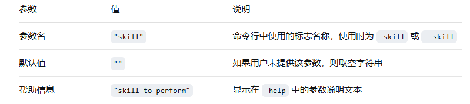

## 4，函数类型实现接口

```go
// 调用接口器
type Invoker interface {
	// 需要实现一个Call方法
	Call(interface{})
}

// 结构体类型
type Struct struct {
}

// 实现Invoker的Call
func (s *Struct) Call(p interface{}) {
	fmt.Println("from struct", p)
}

// 函数定义为类型
type FuncCaller func(interface{})

// 实现Invoker的Call
func (f FuncCaller) Call(p interface{}) {
	// 调用函数 f 本体
	f(p)
}

func main() {
	// 声明接口变量
	var invoker Invoker

	// 实例化结构体
	s := new(Struct)

	// 将实例化的结构体赋值到接口
	invoker = s

	// 将实例化的结构体赋值到接口
	invoker.Call("hello")

	// 将匿名函数转为FuncCaller类型，再赋值给接口
	invoker = FuncCaller(func(v interface{}) {
		fmt.Println("from function", v)
	})

	// 使用接口调用FuncCaller.Call内部会调用函数本体
	invoker.Call("hello")
}
```

from struct hello
from function hello

```go
func (s *Struct) Call(p interface{}) {
    //  ↑                     ↑
    // 接收者形参            普通形参
}
```

# 六、Go语言接口

## 1，接口声明

```go
type 接口类型名 interface {
    方法名1( 参数列表1 ) 返回值列表1
    方法名2( 参数列表2 ) 返回值列表2
    ...
}
```

接口在命名时，一般会在单词后面添加 er ；

当方法名**首字母是大写时**，且这个**接口类型名首字母也是大写**时，这个方法可以被接口所在的包（package）之外的代码访问。参数列表和返回值列表中的参数变量名可以被忽略，例如：

```go
type writer interface{
    Write([]byte) error
}
```

**开发中常见的接口及写法**：Go语言提供的很多包中都有接口，例如 io 包中提供的 Writer 接口：

```go
type Writer interface {
    Write(p []byte) (n int, err error)
}

// 这个接口可以调用 Write() 方法写入一个字节数组（[]byte），返回值告知写入字节数（n int）和可能发生的错误（err error）。
```

## 2，Go语言实现接口的条件

**1）接口的方法与实现接口的类型方法格式一致：**

在类型中添加与接口签名一致的方法就可以实现该方法。签名包括方法中的名称、参数列表、返回参数列表。

```go
// 定义一个数据写入器
type DataWriter interface {
    // interface{} 表示可以接收任何类型的数据
	WriteData(data interface{}) error
}

// 定义文件结构，用于实现DataWriter
type file struct {
}

// 实现 DataWriter 接口的 WriteData 方法
func (d *file) WriteData(data interface{}) error {
	// 模拟写入数据
	fmt.Println("WriteData：", data)
	return nil
}

func main() {
	// 实例化 file
    // 创建 *file 类型的指针
	f := new(file)

	// 声明一个DataWriter类型的变量writer
	var writer DataWriter

	// 将接口赋值 f，也就是 *file类型
	writer = f

	// 使用DataWriter接口进行数据写入
	writer.WriteData("1433223")
}
```

**2）接口中所有方法均被实现**

```go
// 定义一个数据写入器
type DataWriter interface {
	WriteData(data interface{}) error

	// 能否写入
	CanWrite() bool
}

// 定义文件结构，用于实现DataWriter
type file struct {
	isWritable bool // 添加状态字段
}

// 实现DataWriter接口的WriteData方法
func (d *file) WriteData(data interface{}) error {
	if !d.CanWrite() {
		return fmt.Errorf("无法写入数据")
	}
	// 模拟写入数据
	fmt.Println("WriteData:", data)
	return nil
}

// 实现CanWrite方法
func (d *file) CanWrite() bool {
	return d.isWritable
}

func main() {
	// 实例化file，并设置可写状态
	f := &file{isWritable: true}

	// 声明一个DataWriter的接口
	var writer DataWriter

	// 将接口赋值f，也就是*file类型
	writer = f

	err := writer.WriteData("data")

	if err != nil {
		fmt.Println("写入失败；", err)
	}

	// 测试不可写状态
	f2 := &file{isWritable: false}
	writer = f2
	err = writer.WriteData("test")
	if err != nil {
		fmt.Println("写入失败：", err)
	}
}
```

## 3，Go语言类型与接口的关系

1）一个类型可以实现多个接口

一个类型可以同时实现多个接口，而接口间彼此独立，不知道对方的实现。

​		网络上的两个程序通过一个双向的通信连接实现数据的交换，连接的一端称为一个 Socket。Socket 能够同时读取和写入数据，这个特性与文件类似。因此，开发中把文件和 Socket 都具备的读写特性抽象为独立的读写器概念。Socket 和文件一样，在使用完毕后，也需要对资源进行释放。把 Socket 能够写入数据和需要关闭的特性使用接口来描述，请参考下面的代码：

```go
type Socket struct {
}

func (s *Socket) Write(p []byte) (n int, err error) {
    return 0, nil
}

func (s *Socket) Close() error {
    return nil
}
```

Socket 结构的 Write() 方法实现了 io.Writer 接口：

```go
type Writer interface {
    Write(p []byte) (n int, err error)
}
```

同时，Socket 结构也实现了 io.Closer 接口：

```go
type Closer interface {
    Close() error
}
```

使用 Socket 实现的 Writer 接口的代码，无须了解 Writer 接口的实现者是否具备 Closer 接口的特性。同样，使用 Closer 接口的代码也并不知道 Socket 已经实现了 Writer 接口，如下图所示。

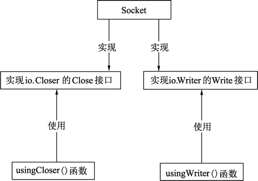


在代码中使用 Socket 结构实现的 Writer 接口和 Closer 接口代码如下：

```go
// 使用io.Writer的代码, 并不知道Socket和io.Closer的存在
func usingWriter( writer io.Writer){
    writer.Write( nil )
}

// 使用io.Closer, 并不知道Socket和io.Writer的存在
func usingCloser( closer io.Closer) {
    closer.Close()
}

func main() {

    // 实例化Socket
    s := new(Socket)

    usingWriter(s)

    usingCloser(s)
}
```

**2）多个类型可以实现相同的接口**

Service 接口定义了两个方法：一个是开启服务的方法（Start()），一个是输出日志的方法（Log()）。使用 GameService 结构体来实现 Service，GameService 自己的结构只能实现 Start() 方法，而 Service 接口中的 Log() 方法已经被一个能输出日志的日志器（Logger）实现了，无须再进行 GameService 封装，或者重新实现一遍。所以，选择将 Logger 嵌入到 GameService 能最大程度地避免代码冗余，简化代码结构。详细实现过程如下：

```go
// 一个服务需要满足能够开启和写日志的功能
type Service interface {
    Start()  // 开启服务
    Log(string)  // 日志输出
}

// 日志器
type Logger struct {
}

// 实现Service的Log()方法
func (g *Logger) Log(l string) {

}

// 游戏服务
type GameService struct {
    Logger  // 嵌入日志器
}

// 实现Service的Start()方法
func (g *GameService) Start() {
}
```

此时，实例化 GameService，并将实例赋给 Service，代码如下：

```go
var s Service = new(GameService)
s.Start()
s.Log(“hello”)
```


