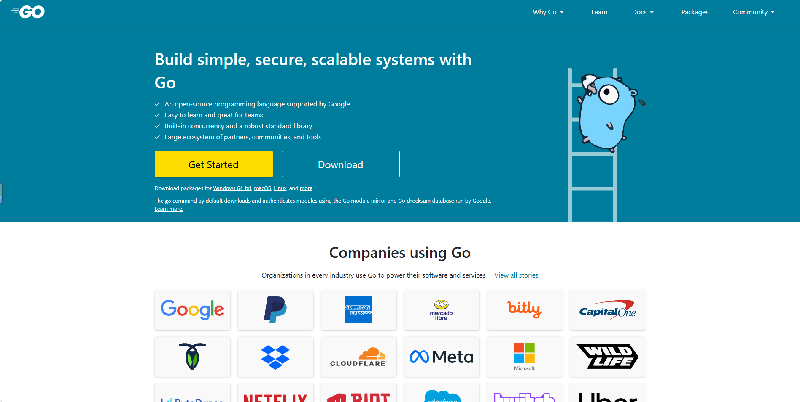
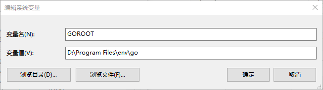
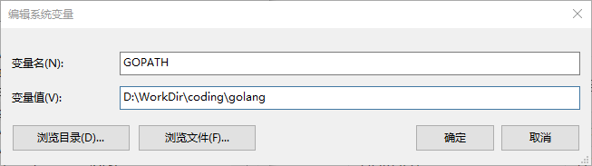
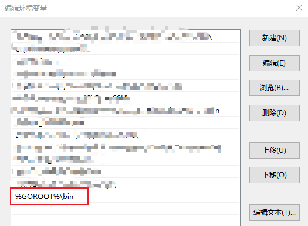
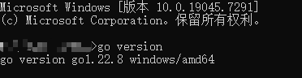
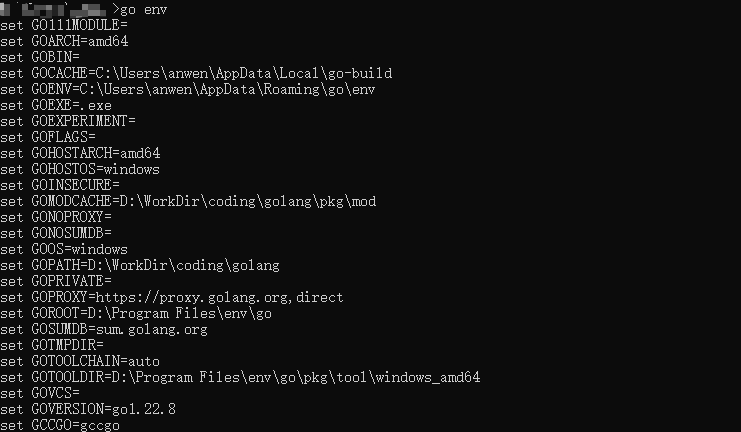

# 1，赘述

下载好对应系统架构的go语言压缩包，官网：https://golang.google.cn



本文档版本golang1.22.8

# 2，开始

这里我们需要新建两个系统变量：1）go环境包所在目录；2）go工作目录（你写代码的目录）；

| 变量名 | 变量值                   |
| ------ | ------------------------ |
| GOROOT | D:\Program Files\env\go  |
| GOPATH | D:\WorkDir\coding\golang |





然后我们配置一下bin目录到Path变量中



# 3，验证

查看版本号

```cmd
go version
```



查看go环境变量

```cmd
go env
```

