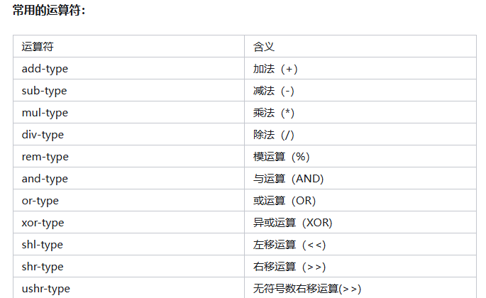
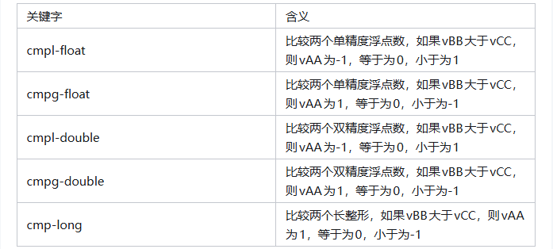
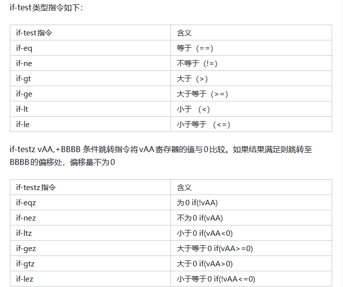

smali文件语法（Dalvik指令）

### 1. 数据类型

| 语法 | Java类型               |
| ---- | ---------------------- |
| V    | void，只用于返回值类型 |
| Z    | boolean                |
| B    | byte                   |
| S    | short                  |
| C    | char                   |
| I    | int                    |
| J    | long                   |
| F    | float                  |
| D    | double                 |
| L    | 类                     |
| [    | 数组类型               |

默认Dalvik寄存器是32位，J和D是64位类型，需要使用两个相邻的寄存器来存储。

### 2. 方法

方法表示

方法用`.method`表示开始，`.end`表示结束。用`#`来添加注释，`# virtual methods`表示这是一个虚方法，`# direct methods`表示一个直接方法

方法表示语法为：

> Lpackage/name/ObjectName;->MethodName(III)Z

Lpackage/name/ObjectName;	表示类型

MethodName 表示 ObjectName 类下面的方法

III表示三个整数参数

Z表示为返回bool类型的值

例子：

> method(I[[IILjava/lang/String;[Ljava/lang/Object;)Ljava/lang/String;

I int,[[I int\[][],I int,String类,Object类数组     Ljava/lang/String;返回类型为String

对应java为：

> String method(int,int\[][],int,String,Object[])

:star:方法调用：

| 指令                      | 含义                   |
| ------------------------- | ---------------------- |
| invoke-virtual (/range)   | 用于调用实例的虚方法   |
| invoke-super (/range)     | 用于调用实例的父类方法 |
| invoke-direct (/range)    | 用于调用实例的直接方法 |
| invoke-static (/range)    | 用于调用实例的静态方法 |
| invoke-interface (/range) | 用于调用实例的接口方法 |

1）invoke-virtual

​		调用一个可以被子类重写的普通方法（非私有、非静态、非父类、非接口），标准的多态调用。运行时，虚拟机会根据“当前对象的实际类型”去找对应的方法。比如，`Animal a = new Dog(); a.eat();`，即使变量是 Animal 类型，实际执行的是 Dog 的 eat()，就会用到这个指令。

2）invoke-super

		在子类的方法中，显式调用父类的实现（即 super.method()），不关心多态，强制忽略子类的重写，直接去找父类的方法执行。

例子：你重写了 onCreate()，但第一行通常要写 super.onCreate()，这时用的就是 invoke-super。

3）invoke-direct

调用私有方法、构造方法（<init>），或者调用被 this 调用的方法（且该方法确定的版本在编译期就能决定）。

速度快。因为是私有的或构造方法，不存在多态的可能，哪个类的方法在编译时就定死了。

例子：private void test() 或者 new MyClass() 里的 init。

4）invoke-static

调用静态方法（如 Math.random()）。

不需要对象实例。直接通过类名调用，调用效率最高。

例子：ClassName.staticMethod()。

5）invoke-interface

场景：调用接口中声明的方法。

特征：和 invoke-virtual 类似，也是运行时多态，但它是专门处理接口的。虚拟机会去寻找实现了该接口的具体类的方法。

例子：Runnable r = new Thread(); r.run();。

### 3. 字段

字段表示

字段与方法类型，使用 `.field` 表示。`# instance fields` 表示实例字段，`# static fields` 表示静态字段

字段表示语法为：

> Lpackage/name/ObjectName;->FieldName:Ljava/lang/String;

字段操作指令

对普通字段操作，读使用 `iget` 指令，写使用 `iput` 指令。例如iget、iget-wide、iget-object、iget-boolean、iget-type、iget-char、iget-short

静态字段操作，读使用 `siget` 指令，写使用 `sput` 指令

### 4. 寄存器

> 寄存器声明，可以理解为变量开辟的存储数量。

使用关键.registers 、.local 、.param。

.registers N表示寄存器总数为N

.local N表示为方法内的寄存器数量,通常用v字母开头表示。如：v0、v1、v2....

.param 指定方法参数名，通常用p字母开头表示。如：p0、p1、p2...

### 5. 类型变量

**声明变量，使用关键字** `const`；

64位的常规类型的字节码添加-wide后缀，像long，double等，占两个寄存器；

特殊类型的字节码，添加特殊的后缀。可以是--boolean，-byte，-char，-short，-int，-long，-float，-double，-object，-string，-class，-void等。

对于会产生歧义的，会添加/字节码来消除歧义。

指令 move-wide/from16 vAA,vBBBB 为例，move为基础字节码，表示一个基本操作。-wide为名称后缀，表示操作的数据宽度为64位。`from16`为字节码后缀，`表示一个来自16位的寄存器引用变量`。vAA为目标寄存器，vBBBB为源寄存器

> 常量、字符串、类

const (/4/16/high16) vA,xx 表示将xx赋值给vA，/后面根据xx长度选择

const-wide(/16/32/high16) vAA，xxxx 表示将xxxx赋值给寄存器vAA、vAA+1 ，/后面根据xxxx长度选择

const-string(/jumbo) vAA,xxxx 表示通过字符串索引构造一个字符串并赋值给vAA，较大时使用/jumbo 后缀

const-class(/jumbo) vAA,xxxx 表示通过类型索引获取一个类引用，并赋值给vAA

> 数组

array-length vA,vB 指令用于获取给定vB寄存器中数组的长度，并将值赋予给vA寄存器

new-array(/jumbo) vA,vB,type@CCCC 指令用于构造制定类型（type@CCCC）和大小（vB)的数组，并将值赋予vA寄存器

filled-new-array(/range/jumbo) {vC,vD,vE,vF,vG} , type@BBBB 指令用于构造制定类型（type@BBBB)和大小 （vA)的数组并填充内容。vA是隐含使用，除了制定数组的小，还指定参数个数。vC-vG是使用的参数寄存器序列。需要指定取值范围时，filled-new-array/range {vCCCC....vNNNN} 这种格式。

fill-array-data vAA,xxxx 指令用指定的数据来填充数组

arrayop vAA,vBB,vCC 指令用于对vBB寄存器指定的数组元素进行取值与赋值。vCC 寄存器用于指定数组元素的索引。vAA寄存器用于存放读取和需要设置数据组元素的值。读取元素时使用aget指令，赋值时使用aput指令。

### 6. 数据操作

数据操作的指令位move，数据返回指令为return

move (/16/from16) vA，vB 用于将vB寄存器的值赋予vA寄存器。

move-wide(/from16) vAAAA,vBBBB 用于将vBBBB寄存器的值赋予vAAAA寄存器

move-object(/16/from16) vAAAA,vBBBB 用于为对象赋值

move-result vAA 用于将上一个invoke调用的方法非对象结果赋予vAA寄存器。move-result-wide 表示占用连续寄存器赋值，move-result-object 表示方法对象结果赋值

move-exception vAA 表示将运行时异常保存到vAA寄存器。必须在异常处理器内使用，否则无效

return-void 表示函数从一个 void方法返回

return vAA 表示函数返回一个32为非对象值，使用8位寄存器。-wide表示64位非对象值，使用相邻两个8位寄存器，-object表示对象类型返回值。

### 7. 类型转换与检查

check-cast(/jumbo) vAA,type@BBBB 表示将vAA中的对象引用转换成指定类型

instance-of(/jumbo) vA,vB,type@CCCC 用于判断vB中的对象引用是否可以转换成type@CCCC类型，可以vA寄存器中值位1，不可以vA值为0

new-instance(/jumbo) vAA，type@BBBB 指令用于构造一个指定类型对象的新实例，并将对象引用赋值给vAA寄存器

| 指令                                           | 含义                   |
| ---------------------------------------------- | ---------------------- |
| neg-int(long/float/double)                     | 对数值做减法运算       |
| not-int(long/float/double)                     | 对数值取反             |
| int(long/float/double)-long(/float/double/int) | 表示数值转换           |
| int-to-byte                                    | 用于将整形转换为字节   |
| int-to-char                                    | 用于将整形转换为字符串 |
| int-to-shot                                    | 用于将整形转换为短整形 |

### 8. 数据运算

上述运算符 vAA,vBB,vCC 指令用于将vBB与vCC进行运算，将结果保存到vAA寄存器

上述运算符/2ddr vA,vB 用于将vA与vB进行运算，将结果保存到vA寄存器中

上述运算符/lit16/lit8 vA,vB,xxx 用于将vB与常量xxx进行运算，将结果保存到vA寄存器中

### 9. 比较

比较指令是用于对两个寄存器的值进行比较，格式为cmpxxx vAA,vBB,vCC。其中vBB与vCC是需要比较的两个寄存器或寄存器对，比较的结果放到vAA中

### 10. 条件和跳转

指令跳转分为三种类型，一种goto跳转，分支switch跳转，条件跳转if

goto +AA 表示指令用于无条件跳转至指定便宜处，偏移量AA不为0

packed-switch vAA,+BBBB 分支跳转指令，vAA寄存器为switch分支中需要判断的值，BBBB指向一个packed-switch-payload格式的偏移表，表中的值是递增的偏移量

sparse-swicth vAA,+BBBB 分支跳转指令，vAA寄存器为switch分支中需要判断的值，BBBB指向一个sparse-switch-payload格式的偏移表，表中的值是递增的偏移量

if-test vA,VB,+CCCC 条件跳转质量用于比较vA寄存器和vB寄存器中的值。如果条件满足就跳转至CCCC偏移处，偏移量不能为0

### 11. 其他

类声明

.class 类的包名及完整签名

.super 类的父类包名及完整签名

注释

smail文件用#表示注释，且只支持单行

注解

注解会添加#annotaions注释，并用.annotation指令开始，以.end annotation指令结束

行号

.line表示java源文件中的行信息

锁指令

monitor-enter vAA表示为vAA加锁

monitor-exit vAA 表示释放指定对象的锁

异常指令

throw vAA 用于抛出vAA寄存器中指定类型的异常

